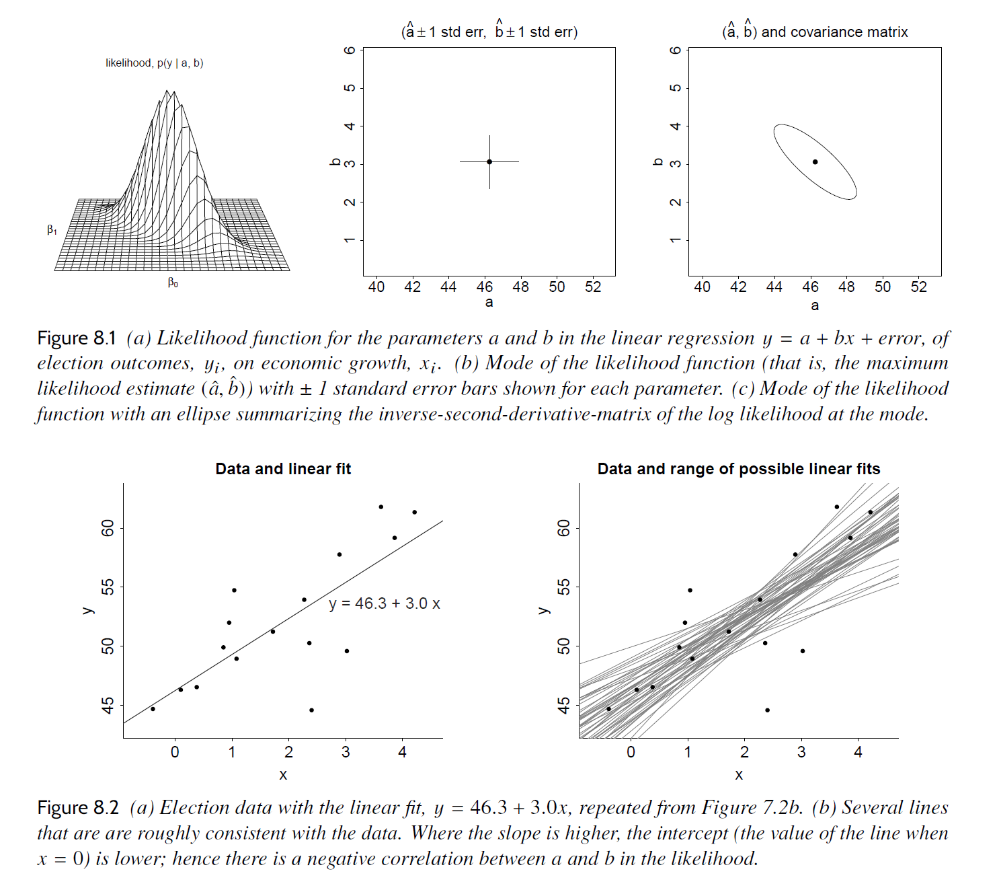

# Chapter 8: Fitting regression models

[(Return to README)](./README.md)

Ah.  Last chapter, I was feeling an absence on the part of the book.  They
hadn't yet described "the optimization routine that leads to coefficient
estimation."  But the book says in this chapter, unlike most of the book, "we
lay out some of the mathematical structure of inference for regression models
and some algebra to help understand estimation for linear regression. We also
explain the rationale for the use of the Bayesian fitting routine `stan_glm` and
its connection to classical linear regression."

## Subsection rundown

### 8.1, Least squares, maximum likelihood, and Bayesian inference

#### Least squares

For a model estimate $(\hat{a}, \hat{b})$, the residuals are 
$r_i = y_i - (\hat{a} + \hat{b}x_i)$: "We distinguish between the *residuals*
\[...\] and the *errors*\[...\]. The model is written in terms of the errors,
but it is the residuals that we can work with: we cannot calculate the errors as
to do so would require knowing $a$ and $b$."

They present the normal equations, $\hat{\beta} = (X^TX)^{-1}X^Ty$, which turn
into fun formulae in the univariate case:

$$\hat{b} = \frac{\sum_{i=1}^n (x_i - \bar{x})(y_i - \bar{y})}{\sum_{i=1}^n(x_i - \bar{x})^2}$$

$$\hat{a} = \bar{y} - \hat{b}\bar{x}$$

$$y_i = \bar{y} + \hat{b}(x_i - \bar{x}) + r_i$$

#### Estimation of residual standard deviation $\sigma$

Because $(\hat{a}, \hat{b})$ are derived from the data, the root-mean-squared
of the $r_i$s underestimates the actual error standard deviation $\sigma$:
they call this an overfitting phenomenon.  They recommend, for a $k$ parameter
model (and the intercept term counts as a parameter), using:

$$\hat{\sigma} = \sqrt{\frac{1}{n - k}\sum_{i=1}^n r_i^2}$$

And this automatically introduces the idea of "what if you have fewer data than
predictors."

They don't provide any intuition for why this $n - k$ denominator is a good
choice.

#### Computing the sum of squares directly

Yup, a function "intended for home consumption and not production use" that
computes the residual sum of squares for a given $(a, b)$ model.

#### Maximum likelihood

Here they link up with a normal distribution of the error terms,

$$y_i \sim \mathcal{N}(a + bx_i, \sigma)$$

and the independence of each draw from , meaning:

$$\text{Pr}(y | a, b, \sigma, X) = \frac{1}{\left(\sqrt{2\pi}\sigma\right)^n}\prod_{i=1}^n \exp\left[-\frac{1}{2}\left(\frac{y_i - (a + bx_i)}{\sigma}\right)^2\right]$$

Note: "the least squares estimate \[...\] *can be* viewed as a maximum likelihood
estimate under the normal model."  Emphasis mine.  You don't *have* to view it
this way, but if you do, the normal-errors assumption is sufficient to give you
the normal equations.

They say that "careful study of \[the previous equation\] reveals that
maximizing the likelihood requires minimizing the sum of squared residuals."
This comes from doing a log transform (minimizing $f$ is the same as minimizing
$\log f$):

$$\log \text{Pr}(y | a, b, \sigma, X) = -n\log \{\sqrt{2\pi}\sigma\} - \frac{1}{2\sigma^2} \sum_{i=1}^n \left(y_i - (a + bx_i)\right)$$

The terms associated with $\sigma$ are constant w.r.t. our model parameters
$(a, b)$, and so they drop out under an optimization routine:

$$\begin{align}(\hat{a}, \hat{b}) &= \arg \max_{a, b} \text{Pr}(y | a, b, \sigma, X) \\
 &= \arg \max_{a, b} \log \text{Pr}(y | a, b, \sigma, X) \\
 &= \arg \max_{a, b} \left[-n\log \{\sqrt{2\pi}\sigma\} - \frac{1}{2\sigma^2} \sum_{i=1}^n \left(y_i - (a + bx_i)\right) \right] \\
 &= \arg \max_{a, b} \left[-\sum_{i=1}^n \left(y_i - (a + bx_i)\right) \right] \\
 &= \arg \min_{a, b} \left[\sum_{i=1}^n \left(y_i - (a + bx_i)\right) \right]
 \end{align}$$

I don't know what to make of the closing two sentences of this section.  Is it
bad that the max-likelihood estimate of $\sigma$ is the overfitting equation?
Do frequentist approaches to inference not incorporate uncertainty in the other
parameters to show up in the uncertainty described for each individual
parameter?

#### Where do the standard errors come from? Using the likelihood surface to assess uncertainty in the parameter estimates

Introducing the idea of the "uncertainty ellipse," where the uncertainty in
$\hat{a}$ and $\hat{b}$ are correlated.  They use draws from the posterior
distribution of their Bayesian inference of the economy-election dataset to
show how there's a tendency for the intercept to be high when the slope is low,
and vice versa.  Both kinds of line do an okay job of fitting the data.

There's no description, right now, of where the standard errors come from in
Figure 8.1.

#### Bayesian inference

Minimizing the residual sum of squares best fits the data, but "we typically
have prior information about the parameters of the model."  As in, information
above and beyond the data itself, which can be incorporated into the model fit.
More about this is coming in Chapter 9, but the summary for now is a move from
maximum likelihood estimation to maximum *penalized* likelihood estimation.
The penalties fall hardest on parameter values that the prior distribution gives
low credence.

Introduces here the fact that using `stan_glm` means you "obtain a set of
simulation draws that represent the posterior distribution," which then needs
summarizing.

#### Point estimate, mode-based approximation, and posterior simulations

The point estimate they discuss is the posterior mode, for which the
maximum likelihood result is a special case of using uniform/flat priors on the
parameters.  To capture uncertainty, they use simulation draws from a posterior
distribution.  That lets them/us harness the correlations between parameter
values, like the ellipse in Fig 8.2.

Now we get an answer on where standard errors come from: it's the mad sd taken
from `stan_glm`'s simulation draws.  No word on what non-Bayesian model fit
routines use to describe uncertainty ranges.

### 8.2, Influence of individual points in a fitted regression

The estimated regression parameters "are linear functions of the data, $y$."
As in, of the labels only.  The normal equations make this linearity more clear
to me than the cited expressions of (8.3) and (8.4):

$$\hat{\beta} = (X^TX)^{-1}X^Ty$$

That matrix, $(X^TX)^{-1}X^T$, has two rows and $n$ columns for our
slope-intercept univariate model.

To influence the slope, they recommend focusing efforts on data where
$(x_i - \bar{x})$ is of largest magnitude.

I don't find it immediately obvious, when looking at Fig. 8.3, why moving a
$y_i$ where $x_i = \bar{x}$ *only* affects the intercept and not the slope.
I believe the algebra, that no matter how far you pull it up, the slope stays
unchanged.  But it's counterintuitive to me.  I guess because I am implicitly
imagining large displacements of points with $x_i \in [\bar{x} \pm \epsilon]$,
which really would move the slope around.

### 8.3, Least squares slope as a weighted average of slopes of pairs

1.  Take all pairs of points, including self pairs,
2.  calculate each slope, $\text{slope}_{ij} = \frac{y_j - y_i}{x_j - x_i}$,
3.  and take the weighted average of the $n^2$ slopes,
    using $w_{ij} = (x_j - x_i)^2$,

you wind up with a weighted-sum expression that turns into our equation for
the least squares slope, $\hat{b}$.

I file this away next to the motivation/intuition of the
maximum-likelihood-assuming-normal-errors section above.  It's an interesting
way to arrive at the normal equations.  I think they're even saying as much when
they say the choice of weight scheme "relate\[s\] to the use of the normal
distribution for errors (which is in turn motivated by the Central Limit
Theorem\[...)\]".

### 8.4, Comparing two fitting functions: `lm` and `stan_glm`

Two reasons they switched to `stan_glm`:

1.  The computed simulations "represent uncertainty and can be used to obtain
    standard errors and predictive distributions for any function of current
    data, future data, and parameters."
2.  You can slap a prior on there, both to incorporate that extra information
    and "to get more stable estimates."

The examples in the book so far, like the mother-daughter height of Chapter 6,
all used `stan_glm` with weak priors, "to keep the coefficient estimates stable
in some pathological cases such as near-collinearity."  So it hasn't been
generating estimates too different than other routines like `lm` would have.

#### Confidence intervals, uncertainty intervals, compatibility intervals

Standard errors are based on the standard deviation of the distribution the
estimated value is drawn from.  "For linear regression, the residual standard
deviation $\sigma$ is itself estimated with error."  So they say, instead of
using the usual $\pm2\sigma/\sqrt{n}$ as the uncertainty range, use (a) the
empirical estimate of the residual standard deviation, and (b) a multiplier
based on quantiles of the $t_{n-k}$ distribution (for $k$ predictors).

You can also just use the quantiles of the MCMC draws that `stan_glm` produces
for each parameter, and skip the whole standard error, mad sd, etc., stuff.

## Exercises

Plots and computation powered by [Chapter08.ipynb](./notebooks/Chapter08.ipynb)

### 8.1, Least squares

> The folder `ElectionsEconomy` contains the data for the example in Section
> 7.1.  Load these data, type in the R function `rss()` from page 104, and
> evaluate it at several different values of $(a, b)$. Make two graphs: a plot
> of the sum of squares of residuals as a function of $a$, with $b$ fixed at its
> least squares estimate given in Section 7.1, and a plot of the sum of squares
> of residuals as a function of $b$, with $a$ fixed at its least squares
> estimate. Confirm that the residual sum of squares is indeed minimized at the
> least squares estimate.

TK

### 8.2, Maximum likelihood

> Repeat the previous exercise but this time write a function, similar to
> `rss()` on page 104, that computes the logarithm of the likelihood (8.6) as a
> function of the data and the parameters $a, b, \sigma$. Evaluate this function
> as several values of these parameters, and make a plot demonstrating that it
> is maximized at the values computed from the formulas in the text (with
> $\sigma$ computed using $\frac{1}{n}$, not $\frac{1}{n-2}$ see page 104).

TK

### 8.3, Least absolute deviation

> Repeat 8.1, but instead of calculating and minimizing the sum of squares of
> residuals, do this for the sum of absolute values of residuals. Find the
> $(a, b)$ that minimizes the sum of absolute values of residuals, and plot the
> sum of absolute values of residuals as a function of $a$ and of $b$.
> Compare the least squares and least absolute deviation estimates of $(a, b)$.

TK

### 8.4, Least squares and least absolute deviation

> Construct a set of data $(x, y)_i$, $i = 1, \ldots, n$, for which the least
> squares and least absolute deviation (see Exercise 8.3) estimates of $(a, b)$
> in the fit, $y = a + bx$, are much different. What did you have to do to make
> this happen?

TK

### 8.5, Influence of individual data points

> A linear regression is fit to the data below. Which point has the most
> influence (see Section 8.2) on the slope?

TK

### 8.6, Influence of individual data points

> (a) Using expression (8.3), compute the influence of each of the data points
>     in the election forecasting example on the fitted slope of the model. Make
>     a graph plotting influence of point $i$ vs. $x_i$.
>
> (b) Re-fit the model $n$ times, for each data point $i$ adding 1 to $y_i$.
>     Save $\hat{b}$ from each of these altered regressions, compare to the
>     $\hat{b}$ from the original data, and check that the influence is
>     approximately the same as computed above using the formula. (The two
>     calculations will not give identical results because `stan_glm` uses a
>     prior distribution and so it does not exactly yield the least squares
>     estimate.)

TK

### 8.7, Least squares slope as a weighted average of individual slopes

> (a) Prove that the weighted average slope defined in equation (8.8) is
>     equivalent to the least squares regression slope in equation (8.3).
>
> (b) Demonstrate how this works in a simple case with three data points,
>     $(x, y) = (0, 0), (4, 1), (5, 5)$.

TK

### 8.8, Comparing `lm` and `stan_glm`

> Use simulated data to compare least squares estimation to default Bayesian
> regression:
>
> (a) Simulate 100 data points from the model, $y = 2 + 3x + \text{error}$, with
>     predictors $x$ drawn from a uniform distribution from 0 to 20, and with
>     independent errors drawn from the normal distribution with mean 0 and
>     standard deviation 5. Fit the regression of $y$ on $x$ data using `lm`
>     and `stan_glm` (using its default settings) and check that the two
>     programs give nearly identical results.
>
> (b) Plot the simulated data and the two fitted regression lines.
>
> (c) Repeat the two steps above, but try to create conditions for your
>     simulation so that `lm` and `stan_glm` give much different results.

TK

### 8.9, Leave-one-out cross validation

> As discussed in the context of (8.5), the root mean square of residuals,
> $\sqrt{\frac{1}{n}\sum_{i=1}^n(y_i - (\hat{a} + \hat{b}x_i))^2}$, is an
> underestimate of the error standard deviation $\sigma$ of the regression
> model, because of overfitting, that the parameters $a$ and $b$ are estimated
> from the same $n$ data points as are being used to compute the residuals.
> Cross validation, which we discuss in detail in Section 11.8, is an
> alternative approach to assessing predictive error that avoids some of the
> problems of overfitting. The simplest version of cross validation is the
> leave-one-out approach, in which the model is fit n times, in each case
> excluding one data point, fitting the model to the remaining $n - 1$ data
> points, and using this fitted model to predict the held-out observation:
> 
> * For $i = 1, \dots, n$:
>    * Fit the model $y = a + bx + \text{error}$ to the $n - 1$ data points
>      $(x, y)_j, j \ne i$. Label the estimated regression coefficients as 
>      $\hat{a}_{-i}$, $\hat{b}_{-i}$.
>    * Compute the cross-validated residual,
>      $r_i^{\text{CV}} = y_i - (\hat{a}_{-i} + \hat{b}_{-i}x_i)$.
> * Compute the estimate
>    $\hat{\sigma}^{\text{CV}} = \sqrt{\frac{1}{n}\sum_{i=1}^nr_i^2}$.
>
> (a) Perform the above steps for the elections model from Section 7.1. Compare
> three estimates of $\sigma$: (i) the estimate produced by `stan_glm`,
> (ii) formula (8.5), and (iii) $\hat{\sigma}^{\text{CV}}$ as defined above.
>
> (b) Discuss any differences between the three estimates.

TK

### 8.10 Leave-one-out cross validation

> Create a fake dataset $(x, y)_i, i = 1, \dots, n$, in such a way that there
> is a big difference between $\hat{\sigma}^{\text{CV}}$ as defined in the
> previous exercise, and the estimated residual standard deviation from (8.5).
> Explain what you did to create this discrepancy.

TK