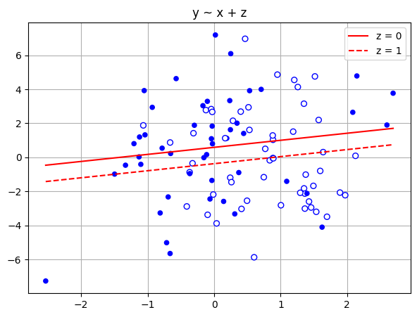
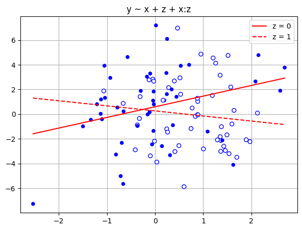
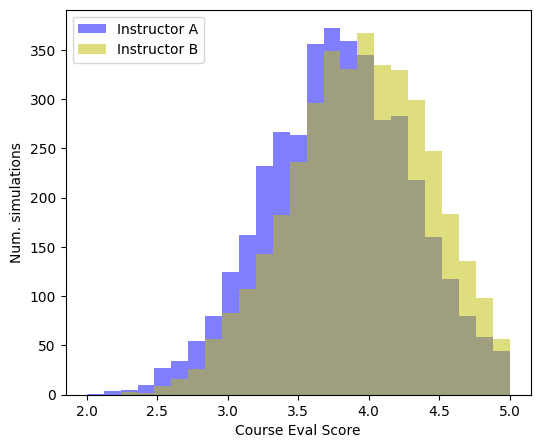
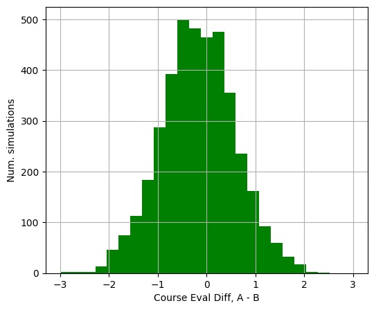

# Chapter 10: Linear regression with multiple predictors

[(Return to README)](./README.md)

Three challenges of moving to multiple-predictor models:

1.  what predictors to include/omit,
2.  how to interpret the fit coefficient values and their interdependencies,
3.  constructing new predictors from an existing set to capture nonlinearity.

## Subsection rundown

### 10.1, Adding predictors to a model

I get that they've pushed it into the next chapter, but it's interesting that
they talk about using the single binary predictor to predict kid IQ, and then
using the single continuous predictor, and in neither case provide a sense of
how good a job the model is doing.  When they do combine the two into a model
that leverages both predictors, they *do* include median and mad sd for the
$\sigma$ error parameter.  (It's also a bit unfortunate that the coefficients
are the same whether the predictor is used in the univariate or the multivariate
model.)

### 10.2, Interpreting regression coefficients

"Change predictor $k$ while leaving the others constant" doesn't work when
"the others" are linked to $k$; in their examples, where you have some
predictors that are polynomials over other predictors.

They fall back to first principles on interpreting coefficients:

1.  *Predictive interpretation:* the coefficient $\beta_k$ tells you how much to
    expect the average output to change between two groups that differ by one
    unit in predictor $k$, while holding all other predictors constant.
2.  *Counterfactual interpretation:* the causal inference case, where you're
    saying "if I changed predictor $k$ to be one unit higher in this individual,
    I should expect the output for this individual to be $\beta_k$ higher."

They say be careful with the counterfactual interpretation; don't even use the
common gentler rewording of "a change in $k$ is associated with a $\beta_k$
change in $y$":

> From the data alone, a regression only tells us about comparisons between
> units, not about changes within units.

Taking this seriously means you have to use the word "comparing" when describing
what $\beta_k$ means, in a much longer sentence than you want to have to use.

> \[Our guidelines prescribe\] an awkward way to put things, which helps explain
> why people often prefer simpler formulations such as “a change of 1 in $x_k$
> causes, or is associated with, a change of $\beta_k$ in $y$”—but those sorts
> of expressions can be terribly misleading. You just have to accept that
> regression, while a powerful data-analytic tool, can be difficult to
> interpret.

### 10.3, Interactions

By their notation, an interaction is like `height:weight`, which means

`y ~ height:weight`

translates to a model of

$$y = \beta_0 + \beta_1 * \text{height} * \text{weight} + \text{error}$$

Their example is more typical, where the individual predictors are included as
well as their interaction.  And since one of their predictors is binary, the
result is like fitting two univariate regressions on the two subsets of the
data, split on the binary variable value.

Their advice for looking for interaction candidates: "the first place we
typically look for them is with predictors that have large coefficients when
not interacted."

### 10.4, Indicator variables

This goes over one-hot encoding of categorical variables, which they call
indicator variables.  The `stan_glm` method picks one category as a baseline,
and reports coefficients in terms of how much they nudge $y$ away from the
average for that baseline category.  Put another way, a categorical predictor
with $r$ categories produces $r-1$ binary entries in the feature vector.

They also close by discussing index variables, where each
category is associated with a real-valued scalar (in their example, you could
have an indicator variable for what school the observation came from, and an
index variable for the school's average household income).

### 10.5, Formulating paired or blocked designs as a regression problem

They describe "paired designs," where $n$ subjects are grouped into $n/2$ pairs,
one of each pair is given the treatment and held back as control, and the
difference (treated subject minus control subject) within each pair is
estimated.

This can get posed as a regression over all $n$ subjects, where each subject
gets their treatment status as an indicator variable, as well as an indicator
for which of the $n/2$ pairs the subject was in.

They don't explain why you'd do this pair design in the first place.  Their
follow up, blocking, makes more sense -- it expands the "pair" (which has
exactly two members) to a "block" (which can have any number of members among
the $n$ subjects), and include group ID as an indicator variable.

### 10.6, Example: uncertainty in predicting congressional elections

They fit a model that predicts 1988 Dem two-party vote share in each
congressional district, given 1986 vote share an a "trinary" incumbency
indicator variable.  They then use it to run simulation-based predictions of
outcomes for the 1990 Congressional elections (including number of Dem seats).

That last derived quantity, estimated number of seats won by Dems, is crucial
for the point they make:

> This estimate and standard deviation could not simply be calculated from the
> estimates and uncertainties for the individual districts.  Simulation is the
> only practical method of assessing the predictive uncertainty for this
> nonlinear function of the predicted outcomes.

They kind of speed through a rerun of "what are the chances a given race ends in
a tie."  There's a bunch of heuristics offered, but it's a hard thing to give
certainty to.  I think without knowing what you'd do with a precise estimate of
tie-probability, it's hard to tell which of the several options is right for
you.

### 10.7, Mathematical notation and statistical inference

They use tilde-hats, $\tilde{y}$, for predictions derived from a model applied
to new predictor data $\tilde{X}$.  That's in contrast to using normal-hats
$\hat{sigma}$ for parameter estimates.  I'll try and keep those straight from
here on.

Nonidentifiable models are ones with "parameters that cannot be estimated
uniquely -- or, to put it another way, have standard errors of infinity."
The nonidentifed parameters are the ones you can wiggle around in some way
without altering the likelihood value.  Collinearity (one predictor is height
in inches, another is height in centimeters) is the easiest way to achieve this.

Near-collinearity leads to poor identification.  The fitted regression is
"unstable;" if you run it twice on two data sets, the weights can swing from
being all on one predictor to all on its close-cousin.  You should see large
standard errors on those near-collinear predictor coefficient estimates.

On $t$ (is coefficent $k$ probably non-zero) and $F$ (do all the coefficients
together probably have non-zero predictive power) tests, a familiar refrain:

> We have essentially no interest in using hypothesis tests for regression
> because we almost never encounter problems where it would make sense to think
> of coefficients as being exactly zero. Thus, rejection of null hypotheses is
> irrelevant, since this just amounts to rejecting something we never took
> seriously in the first place. In the real world, with enough data, any
> hypothesis can be rejected.

### 10.8, Weighted regression

You can weight each observation when setting up your least squares objective.
(This is probably a good reason for me to not use the ML-ish term "weight" when
I mean what this book calls "a coefficient.")  Three reasons for weighting:

1.  Reweight your sample so it better resembles some population,
2.  Let one row of $X$ stand in for multiple duplicate observations (and have
    the corresponding $y$ entry be the average outcome among those duplicates),
3.  Account for unequal variances across your observations, where a weight $w_i$
    implies $\text{sd}(\epsilon_i) \propto 1/\sqrt{w_i}$.

Those three situations apply to a weight matrix $W$ that's diagonal.  They also
talk about how you can make $W$ stand in for a covariance matrix (I think
there's some semidefinite and symmetry constraints that come with this) to
produce a regression model with correlated errors.  No word on whether the book
will delve into that later, though it's important for "time series, spatial
statistics, cluster samples, and other settings with structured data."

### 10.9, Fitting the same model to many datasets

They present a precursor to multilevel modeling: just partitioning one big
dataset into several smaller ones, and looking at the (unpooled) results all
next to each other.

I look at Figure 10.9 and just can't get much out of it.  The intercept term
is jumping around so much, in a way that prevents me from bothering with the
rest of the coefficients.  Does baseline rate of party identification really
jump two to three buckets every four years?


## Exercises

Plots and computation powered by [Chapter10.ipynb](./notebooks/Chapter10.ipynb)

### 10.1, Regression with interactions

> Simulate 100 data points from the model,
> $y = b_0 + b_1x + b_2z + b_3xz + error$, with a continuous predictor $x$ and a
> binary predictor $z$, coefficients $b = \{1, 2, -1, -2\}$, and errors drawn
> independently from a normal distribution with mean 0 and standard deviation 3,
> as follows. For each data point $i$, first draw $z_i$ , equally likely to
> take on the values 0 and 1. Then draw $x_i$ from a normal distribution with
> mean $z_i$ and standard deviation 1. Then draw the error from its normal
> distribution and compute $y_i$.
> 
> (a) Display your simulated data as a graph of $y$ vs. $x$, using dots and
>     circles for the points with $z = 0$ and $1$, respectively.
>
> (b) Fit a regression predicting $y$ from $x$ and $z$ with no interaction. Make
>     a graph with the data and two parallel lines showing the fitted model.
> 
> (c) Fit a regression predicting $y$ from $x$, $z$, and their interaction. Make
>     a graph with the data and two lines showing the fitted model.

For the interaction-free model, the coefficient estimates are:

coef.     | mean   | sd
--------- | ------ | -----
sigma     | 2.884  | 0.207
Intercept | 0.599  | 0.425
x         | 0.416  | 0.314
z         | -0.946 | 0.631

The parallel lines of that model look like:



With the interaction, it looks quite different:

coef.     | mean   | sd
--------- | ------ | -----
sigma     | 2.850  | 0.207
Intercept | 0.602  | 0.424
x         | 0.862  | 0.395
z         | -0.334 | 0.708
x:z       | -1.272 | 0.646



### 10.2, Regression with interactions

> Here is the output from a fitted linear regression of outcome $y$ on
> pre-treatment predictor $x$, treatment indicator $z$, and their interaction:

```
            Median MAD_SD
(Intercept) 1.2    0.2
x           1.6    0.4
z           2.7    0.3
x:z         0.7    0.5
 
Auxiliary parameter(s):
      Median MAD_SD`
sigma 0.5    0.0
```

> (a) Write the equation of the estimated regression line of $y$ on $x$ for the
>     treatment group, and the equation of the estimated regression line of $y$
>     on $x$ for the control group.
> 
> (b) Graph with pen on paper the two regression lines, assuming the values of
>     $x$ fall in the range (0, 10). On this graph also include a scatterplot of
>     data (using open circles for treated units and dots for controls) that are
>     consistent with the fitted model.

*  Treatment: $y = 3.9 + 2.3x$
*  Control: $y = 1.2 + 1.6x$


### 10.3, Checking statistical significance

> In this exercise and the next, you will simulate two variables that are
> statistically independent of each other to see what happens when we run a
> regression to predict one from the other. Generate 1000 data points from a
> normal distribution with mean 0 and standard deviation 1 by typing
> `var1 <- rnorm(1000,0,1)` in R. Generate another variable in the same way
> (call it `var2`). Run a regression of one variable on the other. Is the slope
> coefficient “statistically significant”? We do not recommend summarizing
> regressions in this way, but it can be useful to understand how this works,
> given that others will do so.

I get a slope of -0.027, with a standard error of 0.032.  This is not
statistically significant.  The mean estimate is within one standard error of
zero slope.

### 10.4, Simulation study of statistical significance

> Continuing the previous exercise, run a simulation repeating this process 100
> times. This can be done using a loop. From each simulation, save the $z$-score
> (the estimated coefficient of `var1` divided by its standard error). If the
> absolute value of the $z$-score exceeds 2, the estimate is “statistically
> significant.”
> 
> To perform this computation, we start by creating an empty vector of
> $z$-scores filled with missing values (NAs). Another approach is to start with
> `z_scores <- numeric(length=100)`, which would set up a vector of zeroes. In
> general, however, we prefer to initialize with NAs, because then when there is
> a bug in the code, it sometimes shows up as NAs in the final results, alerting
> us to the problem. Here is code to perform the simulation:

```
z_scores <- rep(NA, 100)
for (k in 1:100) {
  var1 <- rnorm(1000, 0, 1)
  var2 <- rnorm(1000, 0, 1)
  fake <- data.frame(var1, var2)
  fit <- stan_glm(var2 ~ var1, data=fake)
  z_scores[k] <- coef(fit)[2] / se(fit)[2]
}
```

> How many of these 100 $z$-scores exceed 2 in absolute value, thus achieving
> the conventional level of statistical significance?

I got six stat-sig slopes, which is what you'd expect from a 95% confidence
interval.

### 10.5, Regression modeling and prediction

> The
> [folder `KidIQ`](https://github.com/avehtari/ROS-Examples/tree/master/KidIQ/)
> contains a subset of the children and mother data discussed
> earlier in the chapter. You have access to children’s test scores at age 3,
> mother’s education, and the mother’s age at the time she gave birth for a
> sample of 400 children.
> 
> (a) Fit a regression of child test scores on mother’s age, display the data
>     and fitted model, check assumptions, and interpret the slope coefficient.
>     Based on this analysis, when do you recommend mothers should give birth?
>     What are you assuming in making this recommendation?
> 
> (b) Repeat this for a regression that further includes mother’s education,
>     interpreting both slope coefficients in this model. Have your conclusions
>     about the timing of birth changed?
> 
> (c) Now create an indicator variable reflecting whether the mother has
>     completed high school or not. Consider interactions between high school
>     completion and mother’s age. Also create a plot that shows the separate
>     regression lines for each high school completion status group.
> 
> (d) Finally, fit a regression of child test scores on mother’s age and
>     education level for the first 200 children and use this model to predict
>     test scores for the next 200. Graphically display comparisons of the
>     predicted and actual scores for the final 200 children.

For `kid_score ~ mom_age`, I don't see a slope that's particularly indicative
of a relationship one way or the other:

coef.     | mean   | sd
--------- | ------ | -----
sigma     | 20.388 | 0.689
Intercept | 70.891 | 8.447
mom_age   | 0.698  | 0.370


I can't offer much advice as far as when to give birth if you want to maximize
your child's IQ.  Later, I guess?  But there's nothing really going on in here.

For `kid_score ~ mom_age + mom_hs`, I still see nothing special in terms of
mother's-age-at-birth and eventual child IQ:

coef.     | mean   | sd
--------- | ------ | -----
sigma     | 19.890 | 0.687
Intercept | 70.398 | 8.148
mom_age   | 0.330  | 0.362
mom_hs    | 11.333 | 2.356


Including the "did mom finish high school" term just makes the age coefficient
flatter.

When we include the interaction term,
`kid_score ~ mom_age + mom_hs + mom_age:mom_hs`, the sign has changed and the
magnitude is close to two standard errors away from flat:

coef.          | mean    | sd
-------------- | ------- | -----
sigma          | 19.709  | 0.671	
Intercept      | 108.354 | 16.386
mom_age        | -1.419  | 0.752
mom_hs         | -38.780 | 18.701
mom_age:mom_hs | 2.274   | 0.846


When we add in the interaction term to the age slope, the sign reverses.  Still
a wide standard error associated with it, though.  I wouldn't make any actual
recommendations based on this, though it's leaning towards "no HS? go early.
yes HS? delay."

If we look at posterior predictive ranges for the test set as described for
part (d), we see a whole lotta nothin' goin' on:


The thin lines are 95% credible intervals for a predicted observation, and the
thick center lines are the 50% credible intervals.  The dashed line of perfect
prediction is pretty well covered, but not in an interesting way.

### 10.6, Regression models with interactions:

> [The folder `Beauty` contains](https://github.com/avehtari/ROS-Examples/tree/master/Beauty/data)
> data (use file `beauty.csv`) from Hamermesh and Parker (2005) on student
> evaluations of instructors’ beauty and teaching quality for several courses at
> the University of Texas. The teaching evaluations were conducted at the end
> of the semester, and the beauty judgments were made later, by six students who
> had not attended the classes and were not aware of the course evaluations.
> 
> (a) Run a regression using beauty (the variable `beauty`) to predict course
>     evaluations (`eval`), adjusting for various other predictors. Graph the
>     data and fitted model, and explain the meaning of each of the coefficients
>     along with the residual standard deviation. Plot the residuals versus
>     fitted values.
> 
> (b) Fit some other models, including beauty and also other predictors.
>     Consider at least one model with interactions. For each model, explain the
>     meaning of each of its estimated coefficients.
> 
> See also Felton, Mitchell, and Stinson (2003) for more on this topic.

When I fit a simple linear model on the beauty rating, instructor age, and the
binary indicators for gender, ethnicity, native language, and course level, I
get coefficients:

coef.          | mean   | sd
-------------- | ------ | -----
sigma          | 0.532  | 0.018
Intercept      | 4.197  | 0.143
beauty         | 0.140  | 0.033	
female         | -0.199 | 0.052
age            | -0.002 | 0.003
minority       | -0.071 | 0.076
nonenglish     | -0.274 | 0.111
lower          | 0.098  | 0.053

The number one thing to notice is that `sigma` is basically identical to the
standard deviation of `eval` all on its own.  So the predictors are not
explaining much of anything about evaluation scores.  (The intercept is within
one standard error above the mean of `eval`.)

That said, the beauty and gender features do seem to detect a meaningful slope.
Language background and course level, too, but to a less certain extent. Coding
as non-majority in either of those attributes *probably* decreases your expected
course eval.  Teaching a lower division course probably increases it.

For a teacher of average age (48 years old) who speaks English, is white, and
teaches an upper level class, the model looks like this w.r.t. beauty and
gender:


If I add an interaction term between beauty and gender, I get:

coef.          | mean   | sd
-------------- | ------ | -----
sigma          | 0.531  | 0.017
Intercept      | 4.184  | 0.149
beauty         | 0.187  | 0.045	
female         | -0.204 | 0.054
beauty:female  | -0.101 | 0.064	
age            | -0.002 | 0.003
minority       | -0.043 | 0.078	
nonenglish     | -0.295 | 0.110
lower          | 0.092  | 0.053

The coefficients for the intercept, age, language, and course level don't move
much with the addition of the interaction term.  The coefficient for ethnicity
probably reduced in magnitude.

The real difference is to note that expected course eval increases at a greater
rate as a function of beauty for men than it does for women:


This doesn't much improve predictive power of the model, however.

### 10.7, Predictive simulation for linear regression

> Take one of the models from the previous exercise.
> 
> (a) Instructor A is a 50-year-old woman who is a native English speaker and
>     has a beauty score of -1. Instructor B is a 60-year-old man who is a
>     native English speaker and has a beauty score of -0.5. Simulate 1000
>     random draws of the course evaluation rating of these two instructors. In
>     your simulation, use `posterior_predict` to account for the uncertainty in
>     the regression parameters as well as predictive uncertainty.
> 
> (b) Make a histogram of the difference between the course evaluations for A
>     and B. What is the probability that A will have a higher evaluation?

Using 4,000 draws from the interaction model in 10.6(b) above:



There's a 42% chance Instructor A gets a higher eval than Instructor B.  It's
just not a very informative model!



### 10.9, Collinearity

> Consider the elections and economy example from Chapter 7.
> 
> (a) Create a variable that is collinear to the economic growth predictor in
>     the model. Graph the two predictors to confirm that they are collinear.
> 
> (b) Add this new predictor to the model, in addition to economic growth. Fit
>     the regression and report what happens.
> 
> (c) Create a variable that is nearly collinear to the economic growth
>     predictor, with a 0.9 correlation between the two variables. Fit the
>     regression predicting election outcome given economic growth and this new
>     predictor you have created, and again describe and explain what happens.

TK

### 10.10, Regression with few data points and many predictors

> Re-fit the elections and economy example from Chapter 7, adding several
> economic predictors such as unemployment rate in the year of the election,
> inflation rate in the year of the election, etc. Discuss the difficulties in
> interpretation of the fitted model.

TK