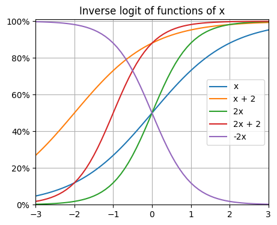
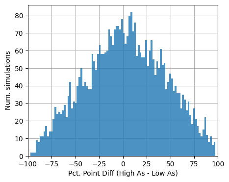
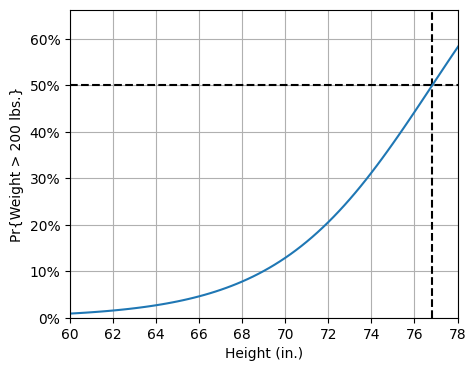

# Chapter 13: Logistic regression

[(Return to README)](./README.md)

This chapter introduces two modifications to the linear regressions run so far:
a mechanism for bounding predictions such that they lie between 0 and 1, and a
model framework that interprets those predictions as probabilities over some
this-or-that outcome pair.  These modifications will make stuff covered so far
-- fitting models, interpreting coefficients -- a bit more complicated.

## Subsection rundown

### 13.1, Logistic regression with a single predictor

When fitting the logistic regression, `stan_glm` doesn't output a `sigma`
coefficient estimate, like it did for linear regression.  "Logistic regression
has no separate variance term; its uncertainty comes from its probabilistic
prediction of binary outcomes."  The $y$ value is itself the reflection of
uncertainty.

The model of the probability that $y = 1$ looks like:

$$\text{logit}(z) = \log\left(\frac{z}{1 - z}\right)$$

$$\text{logit}^{-1}(z) = \frac{e^z}{1 + e^z} = \frac{1}{1 + e^{-z}}$$

$$\text{Pr}(y_i = 1) = \text{logit}^{-1}(X_i\beta)$$

calling the $X\beta$ term the linear predictor.  The change in predicted
probability you get from a fixed increase in the linear prediction depends on
the starting probability.  They do the arithmetic around what happens when the
linear predictor increases by 0.4; going from 0 to 0.4 is a jump from 50% to 60%
but going from 2.2 to 2.6 is only a jump from 90% to 93%.

### 13.2, Interpreting logistic regression coefficients and the divide-by-4 rule

You can, just as a simple default, choose the mean predictors value as the
baseline from which you assess how a predictor affects the output probability.
Plug in $\bar{x}$, get a baseline probability of $y = 1$, then see how that
changes when you increase $x_i$ from its mean value to mean-plus-one-unit.

The steepest part of the inverse logit is at 0, where its slope is $\beta/4$ for
the univariate linear predictor $\alpha + \beta x$.  The upshot is if you divide
a coefficient by four, you get a sense of how much a unit increase in that
predictor moves the predicted probability off of 0.5.

They touch on the log-odds-ratio interpretation of the logistic regression,
which is how I first learned it.  I agree that "the concept of odds can be
somewhat difficult to understand, and odds ratios are even more obscure."
And multiplicative effects on odds ratios are weirdest of all.  It really is
easier to just think in terms of the inverse logit curve squashing the
weighted-sum of the linear predictor into the [0, 1] range.

While there's no `sigma` any more, we do still get standard errors for each
coefficient estimate.  They work like usual: any value within $\pm 2$ of the
mean estimate is consistent with the data.  Don't try and use them as a
statistical significance filter, though, for the usual reasons: it's acting as a
classifier of "real/not real effect" that's too error prone.  Soft decisions
like "do we have certainty in this estimate" are different than hard decisions
of "this estimate is right, that one is wrong."

### 13.3, Predictions and comparisons

Once you have a model, you can produce the three kinds of prediction:

*  **Point prediction:**  Take the mean coefficients, find their dot product
    with $x^{new}$, and run that dot product through the inverse logit.

*  **Linear predictor with uncertainty:** Use the many simulated draws from the
    MCMC run to get an empirical posterior distribution of
    $\beta \cdot x^{new}$.  As in, for 4000 simulations, you get 4000 dot
    products representing the posterior of the linear predictor output.

*  **Expected outcome with uncertainty:** Take the vector you got for "linear
    predictor with uncertanty" and run them through the inverse logit to get
    4000 probabilities.  Summarize those 4000 however you like.  You can even
    use a weighted-coin-flipper to turn them into 4000 $y^{new} \in {0, 1}$
    bits if you want.

From there, the chapter goes into special cases like:

*  **Just an intercept:** it's the same as estimating a proportion (i.e.,
    an average of bits).
*  **A single binary predictor:** it's the same as estimating a difference in
    proportions.

Not that you should use logistic regression for those estimates, they say, but
just to emphasize their commonality.

### 13.4, Latent-data formulation

You can imagine a latent variable, $z$, in between the linear prediction and the
predicted probability, where the generative path looks like:

1.  The predictors $x$ produce a linear prediction $x \cdot \beta$, using the
    true coefficient values
2.  Some noise $\epsilon$ is sprinkled on top of the linear prediction;
    call $z$, as in $z = x\cdot\beta + \mathbb{\epsilon}$.  That noise follows
    the logistic distribution, whose pdf is the derivative of the inverse logit. 
    Which is equivalent to
    $\text{Pr}(\mathbb{\epsilon} < x) = \text{logit}^{-1}(x)$.
3.  The outcome $y$ is then a 1 if $z$ is positive and 0 else.

The equation chain for Step 3 there is fun:

$$\text{Pr}(y = 1) = \text{Pr}(z > 0) = \text{Pr}(\mathbb{\epsilon} > -x \cdot \beta) = \text{logit}^{-1}(x \cdot \beta)$$

(This is different than I learned, where the outcome $y$ is not a thresholding
of the latent variable, but a Bernoulli RV with mean $\text{logit}^{-1}(z)$,
perhaps with no noise term added in the generation of $z$?  I never had much
formal definition of it drilled in class.)

The latent variables are a nice way of smushing the predictors together to
provide a richer ordering of the outcomes than their binary values allow.
They include a sentence about how you can bolster your confidence in their
validity if your data has multiple ways of probing them: in their example, not
just asking which candidate you'll vote for, but also questions about your
one-to-five star ratings for each.

They close out by discussing where the `sigma` parameter.  The answer is it's
smothered by nonidentifiability.  For any model pair of $(\beta, \sigma)$,
where $\beta$ are the "true" coefficient values and $\sigma$ is the scale of
the error distribution, you can come up with an infinite number of other pairs
that produce the same $y$ pattern just by scaling $(\beta, \sigma)$ by a common
factor:

> As we move from each of these models to the next, z is multiplied by 10, but
> the sign of z does not change. Thus all the models have the same implications
> for the observed data $y$.

By convention, then, everyone who uses logistic regression just freezes the
scale parameter for the error terms' logistic distribution to 1.0. This feels
like a nice bit of compound interest payoff to discussions of identifiability
back when we introduced collinearity in a recent chapter.

### 13.5, Maximum likelihood and Bayesian inference for logistic regression

When we did linear regression, there was a chapter section dedicated to pointing
out that you could think of the ordinary least squares routine as the result of
seeking a maximum likelihood parameter estimate assuming the error terms were
normally distributed.  You don't have to think about your problem that way to
have least squares make sense, but if you *do* think about your problem that
way, it will *lead you* to using least squares.  They do that here for logistic
regression.

Formula (13.7):

$$p(y | \beta, X) = \prod_{i=1}^n
    \left(\text{logit}^{-1}(X_i\beta)\right)^{y_i}
    \left(1 - \text{logit}^{-1}(X_i\beta)\right)^{1 - y_i}
$$

We tend to want to actually maximize the logarithm of this function, which they
don't write out but I'll put down here:

$$\begin{align}
\log p(y | \beta, X) &= \log\left(\prod_{i=1}^n
                    \left(\text{logit}^{-1}(X_i\beta)\right)^{y_i}
                    \left(1 - \text{logit}^{-1}(X_i\beta)\right)^{1 - y_i}
                   \right) \\
&= \sum_{i=1}^n \log\left(\left(\text{logit}^{-1}(X_i\beta)\right)^{y_i}
                    \left(1 - \text{logit}^{-1}(X_i\beta)\right)^{1 - y_i}
                   \right) \\
&= \sum_{i=1}^n \left[
        y_i\log\left(\text{logit}^{-1}(X_i\beta)\right)
        + (1 - y_i)\log\left(\text{logit}^{-1}(1 - X_i\beta)\right)
    \right] \\
&= \sum_{i=1}^n \left[
        y_i\log\left(\frac{1}{1 + e^{-X_i\beta}}\right)
        + (1 - y_i)\log\left(1 - \frac{1}{1 + e^{-X_i\beta}}\right)
    \right] \\
&= \sum_{i=1}^n \left[
        -y_i\log\left(1 + e^{-X_i\beta}\right)
        + (1 - y_i)\log\left(\frac{1 + e^{-X_i\beta} - 1}{1 + e^{-X_i\beta}}\right)
    \right] \\
&= \sum_{i=1}^n \left[
        -y_i\log\left(1 + e^{-X_i\beta}\right)
        + (1 - y_i)\log\left(\frac{1}{1 + e^{X_i\beta}}\right)
    \right] \\
&= -\sum_{i=1}^n \left[
        y_i\log\left(1 + e^{-X_i\beta}\right)
        + (1 - y_i)\log\left(1 + e^{X_i\beta}\right)
    \right]
\end{align}
$$

In terms of maximizing that (log) likelihood,

*  When $y_i$ is 1,
    *  we want $(1 + e^{-X_i\beta})$ to be as small as possible,
    *  which means we want $X_i\beta$ to be as close to $+\infty$ as possible.
*  When $y_i$ is 0,
    *  we want $(1 + e^{X_i\beta})$ to be as small as possible,
    *  which means we want $X_i\beta$ to be as close to $-\infty$ as possible.

This is also what we want from our latent variables that drop out of the linear
predictor: the negative examples should have $z_i$ below zero, and the more
below zero, the more likely to be a negative example.

Bayesian inference with a uniform (improper?) prior on the $\beta$ parameters
will operate on a log posterior that's identical to the above log likelihood.

The default priors for logistic regression in `stan_glm` gives a normal prior
with zero mean and standard deviation $2.5/\text{sd}(x_k)$ to $\beta_k$,
*except* for the intercept.  The intercerpt's prior is fun: it's applied as a
prior on the output of the linear predictor evaluated at the mean predictor
vector $\bar{x}$, normal with mean 0 and std. dev. 2.5.  "This is similar to the
default priors for linear regression discussed on page 124, except that for
logistic regression there is no need to scale based on the outcome variable."

They provide a fun example of running the same data through the more-typical
`glm` regression library, as well as `stan_glm` with an informative prior, and
demostrate the shrinkage effect.  (And their results hint at the risks of
getting large effect size estimates when data volume is low in the unregularized
`glm` case.)

### 13.6, Cross validation and log score for logistic regression

It's not totally unheard of to evaluate a logistic regression with the Brier
score, $\frac{1}{n}\sum_{i=1}^n(p_i - y_i)^2$.  You could use that as an
analogue for the posterior residual standard deviation from Section 11.6, and
then use $\frac{1}{n}\sum_{i=1}^np_i(1-p_i)$ as the other component of
Bayesian $R^2$.

But it's not a great fit: the residuals in logistic regression aren't additive,
due to the logit's nonlinear nature.  A delta of 0.01 matters more around
$p_i = 0.5$ than when $p_i << 0.1$.  They recommend log score instead.  And they
recommend using LOO again (whether for log scoring or Brier scoring).

The log score looks exactly like the log likelihood I developed in the previous
section, applid to new data points: $\log p(y^{new} | \beta, X^{new})$.
"The same idea applies more generally to any statistical model: the predictive
log score is the sum of the logarithms of the predicted probabilities of each
data point."

### 13.7, Building a logistic regression model: wells in Bangladesh

They do some simple iterations through a logistic regression: rescaling the
first variable; adding a second variable.  There's some recommendations about
how to plot results.

## Exercises

Plots and computation powered by [Chapter13.ipynb](./notebooks/Chapter13.ipynb)

### 13.1, Fitting logistic regression to data

> The
> [folder NES contains](https://github.com/avehtari/ROS-Examples/tree/master/NES/)
> the survey data of presidential preference and income for the 1992 election
> analyzed in Section 13.1, along with other variables including sex, ethnicity,
> education, party identification, and political ideology.
>
> (a) Fit a logistic regression predicting support for Bush given all these
>     inputs. Consider how to include these as regression predictors and also
>     consider possible interactions.
>
> (b) Evaluate and compare the different models you have fit.
>
> (c) For your chosen model, discuss and compare the importance of each input
>     variable in the prediction.

When I look at the fields `income` and `rvote`, I see two categorical variables:

|         | year | income | rvote
--------- | ---- | ------ | -----
**count** | 1356.00 | 1356.00 | 1356.00
**mean**  | 1992.00 | 3.11 | 0.35
**std**   | 0.00 | 1.08 | 0.48
**min**   | 1992.00 | 1.00 | 0.00
**25%**   | 1992.00 | 2.00 | 0.00
**50%**   | 1992.00 | 3.00 | 0.00
**75%**   | 1992.00 | 4.00 | 1.00
**max**   | 1992.00 | 5.00 | 1.00

#### Model M1: `rvote['1'] ~ income`

Coef.     | Mean  | s.e.
--------- | ----- | ------
Intercept | -1.46 | 0.18
income    |  0.27 | 0.06

Pretty good for such a simple model!

#### Model M2: `rvote['1'] ~ C(income)`

Coef.     | Mean   | s.e.
--------- | ------ | ------
Intercept | -1.18 | 0.19
C(income)[2] | 0.33 | 0.24
C(income)[3] | 0.51 | 0.21
C(income)[4] | 0.78 | 0.21
C(income)[5] | 1.03 | 0.28

Those are pretty wide standard errors on the categorical random variables.
And they also, funnily enough, look like their mean coefficient values are
linearly spaced!

When I compare them, turns out one coefficient for each income bucket does not
help the LOO log scores, though there's substantial overlap in the uncertainty
intervals:


#### Model M3: `rvote['1'] ~ income + age_z + gender`

I added age and gender as attributes, and $z$-scored age.  I left gender a
binary categorical variable, though if I knew which gender 1 stood for, I would
rename it.

I looked at `union` as a feature, but over 75% of rows have a value of 2 for
that attribute -- probably not a lot of lift there.

When I fit this model, I see income is still pretty important, age somewhat
important, and gender basically not at all (or, with high uncertainty).

Coef.     | Mean   | s.e.
--------- | ------ | ------
Intercept | -1.52 | 0.21
income    | 0.29 | 0.06
age_z     | 0.10 | 0.06
gender    | 0.01 | 0.12


#### Model M4: `rvote['1'] ~ income + age_z + gender + age_z:gender`

When I add an interaction for age and gender, that interaction's coefficient is
looking pretty strong relative; one standard error away from zero, anyway.

Coef.     | Mean   | s.e.
--------- | ------ | ------
Intercept | -1.56 | 0.21
income       | 0.29 | 0.06
age_z        | 0.00 | 0.09
gender       | 0.02 | 0.11
age_z:gender | 0.18 | 0.11

But its LOO CV score is idential to M1 and M3:


#### Model M5: `rvote['1'] ~ income + age_z + gender + C(race)`

When I add race as a categorical random variable (five categories, where more
than 75% of respondents are Category 1), I see a big anybody-but-Bush effect
for Category 2 (and a slight bump-up in the intercept, relative to M4):

Coef.     | Mean   | s.e.
--------- | ------ | ------
Intercept | -1.20 | 0.21
income     | 0.23 | 0.06
age_z      | 0.08 | 0.06
gender     | 0.04 | 0.12
C(race)[2] | -2.19 | 0.32
C(race)[3] | 0.78 | 0.44
C(race)[4] | -0.12 | 0.35
C(race)[5] | -0.17 | 0.28

This is a *huge* improvement on the LOO CV metrics:


#### Model M6: `rvote['1'] ~ income + C(race) + income:C(race)`

When I drop the weaker predictors of age and gender, and add an interaction
between income and race, I still see a strong (anti-Bush) effect associated with
Race-2's intercept, but no strong coefficients among the income-race interaction
terms:

Coef.     | Mean   | s.e.
--------- | ------ | ------
Intercept | -1.12 | 0.20
income            | 0.21 | 0.06
C(race)[2]        | -1.35 | 0.64
C(race)[3]        | 0.08 | 0.86
C(race)[4]        | -0.56 | 0.78
C(race)[5]        | -0.61 | 0.64
income:C(race)[2] | -0.36 | 0.24
income:C(race)[3] | 0.23 | 0.26
income:C(race)[4] | 0.15 | 0.26
income:C(race)[5] | 0.17 | 0.24

The resulting LOO CV is identical to M5:


#### Model M7: `rvote['1'] ~ income + age_z + gender + C(race) + real_ideo`

Finally, I add a feature for reported ideology of each respondent, on a 1-7
scale, `real_ideo`:

Coef.     | Mean   | s.e.
--------- | ------ | ------
sigma     | nan | nan
Intercept | -5.02 | 0.41
income     | 0.17 | 0.07
age_z      | -0.04 | 0.07
gender     | 0.18 | 0.15
C(race)[2] | -2.45 | 0.42
C(race)[3] | 0.49 | 0.52
C(race)[4] | -0.22 | 0.44
C(race)[5] | -0.23 | 0.37
real_ideo  | 0.91 | 0.07

It's strongly predictive!  And the LOO CV looks great:


#### Model M8: `rvote['1'] ~ real_ideo`

If I just use ideology, all on its own: great model.  Second best overall.
This gives a sense of how much/little the demographic characteristics (age,
gender, race) are able to fill in the gaps of ideology as a predictor.

Coef.     | Mean   | s.e.
--------- | ------ | ------
Intercept | -4.46 | 0.29
real_ideo | 0.89 | 0.06


### 13.2, Sketching the logistic curve

> Sketch the following logistic regression curves with pen on paper:
>
> (a) $\text{Pr}(y = 1) = \text{logit}^{-1}(x)$
> 
> (b) $\text{Pr}(y = 1) = \text{logit}^{-1}(2 + x)$
> 
> (c) $\text{Pr}(y = 1) = \text{logit}^{-1}(2x)$
> 
> (d) $\text{Pr}(y = 1) = \text{logit}^{-1}(2 + 2x)$
> 
> (e) $\text{Pr}(y = 1) = \text{logit}^{-1}(-2x)$



### 13.3, Understanding logistic regression coefficients

> In Chapter 7 we fit a model predicting incumbent party’s two-party vote
> percentage given economic growth: vote = 46.2 + 3.1 * growth + error, where
> growth ranges from -0.5 to 4.5 in the data, and errors are approximately
> normally distributed with mean 0 and standard deviation 3.8. Suppose instead
> we were to fit a logistic regression,
> $\text{Pr}(\text{vote} > 50) = \text{logit}^{-1}(a + b \times \text{growth})$.
> Approximately what are the estimates of $(a, b)$?
>
> Figure this out in four steps:
>
> (i) use the fitted linear regression model to estimate Pr(vote > 50) for
>     different values of growth;
>
> (ii) second, plot these probabilities and draw a logistic curve through them;
>
> (iii) use the divide-by-4 rule to estimate the slope of the logistic
>    regression model;
>
> (iv) use the point where the probability goes through 0.5 to deduce the
>     intercept.
>
> Do all this using the above information, without downloading the data and
> fitting the model.

Here's the plot you get at step (ii):


That looks like it crosses 50% when the income growth rate is around 1.25%.  And
the slope there is 20 percentage points of win probability (from 40% to 60%)
between the income growth points of 0.95% and 1.5%.  So the maximum slope is
(0.2 / 0.55) = 0.364.

Applying the divide-by-four rule, the logistic regression should have a slope
coefficient of 1.45.

At the 50% point (growth rate: $x = 1.25$), $\alpha + \beta x = 0$, so:

$$\alpha + 1.25\beta = 0 \Rightarrow \alpha = -1.25 \times 1.45 = -1.82$$

The logistic regression model I would expect to get has
$(\alpha, \beta) = (-1.82, 1.45)$.

Note that this implies a win probability of $\text{logit}^{-1}(-1.82) = 14\%$
when income growth is zero, which is within a point or two of the plot above.

### 13.4, Logistic regression with two predictors

> The following logistic regression has been fit:

```
            Median MAD_SD
(Intercept) -1.9    0.6
x            0.7    0.8
z            0.7    0.5
```

> Here, $x$ is a continuous predictor ranging from 0 to 10, and $z$ is a binary
> predictor taking on the values 0 and 1. Display the fitted model as two curves
> on a graph of $\text{Pr}(y = 1)$ vs. $x$.


### 13.5, Interpreting logistic regression coefficients

> Here is a fitted model
> [from the Bangladesh analysis](https://github.com/avehtari/ROS-Examples/tree/master/Arsenic/)
> predicting whether a person with high-arsenic drinking water will switch
> wells, given the arsenic level in their existing well and the distance to the
> nearest safe well:

```
stan_glm(formula = switch ~ dist100 + arsenic, family=binomial(link="logit"), data=wells)
             Median MAD_SD
(Intercept)   0.00   0.08
dist100      -0.90   0.10
arsenic       0.46   0.04
```

> Compare two people who live the same distance from the nearest well but whose
> arsenic levels differ, with one person having an arsenic level of 0.5 and the
> other person having a level of 1.0. You will estimate how much more likely
> this second person is to switch wells. Give an approximate estimate, standard
> error, 50% interval, and 95% interval, using two different methods:
>
> (a) Use the divide-by-4 rule, based on the information from this regression
>     output.
>
> (b) Use predictive simulation from the fitted model in R, under the assumption
>     that these two people each live 50 meters from the nearest safe well.

The divide-by-four rule says that at the 50-50 threshold, this model suggests
one more unit of arsenic would mean, on average, an 11.5 percentage-point jump
in probability of switching.  Because arsenic is only larger by 0.5 units in
our hypothetical, the larger-arsenic person has on average a 5.75 pct. point
increase in switching.  This has a standard error of 1 pct. point.

The uncertainty in the intercept and distance coefficients amount to 0.13, which
is about half the difference made on the linear predictor by the change in
arsenic levels.

I don't think I'm doing part (a) correctly, but I don't know what I'm supposed
to do instead.

Here's the model I fit in Bambi:

Coef.     | Mean  | s.e.
--------- | ----- | ------
Intercept |  0.00 | 0.08
dist100   | -0.90 | 0.10
arsenic   |  0.46 | 0.04

It matches the book's numbers; that's good.

Estimating the difference using the simulations, I get numbers:

*  Mean diff: 2.9 pct. points
*  Std. dev diff: 41.3 pct. points
*  50% range: [-26.2, 33.1] pct. points
*  95% range: [-76.3, 80.5] pct. points

They're from this histogram of percentage point differeces:



The good news here is that range I got with the divide-by-four answer does
pretty much cover the mean I found from Bambi.  But I'm still without a clue how
to get such (large) percentage point difference uncertainty ranges just from the
regression output of (a).

### 13.7, Graphing a fitted logistic regression

> We downloaded data with weight (in pounds) and age (in years) from a random
> sample of American adults. We then defined a new variable:

`heavy <- weight > 200`

> and fit a logistic regression, predicting heavy from height (in inches):

```
stan_glm(formula = heavy ~ height, family=binomial(link="logit"), data=health)

              Median MAD_SD
(Intercept)  -21.51   1.60
height         0.28   0.02
```

> (a) Graph the logistic regression curve (the probability that someone is
>     heavy) over the approximate range of the data. Be clear where the line
>     goes through the 50% probability point.
>
> (b) Fill in the blank: near the 50% point, comparing two people who differ by
>     one inch in height, you’ll expect a difference of __ in the probability of
>     being heavy.

The 50-50 crossover takes place just below 6'5" tall:



Near 6'5", I would expect a difference of 7% in heaviness probability when
comparing two people differing by one inch of height.

### 13.8, Linear transformations

> In the regression from the previous exercise, suppose you replaced height in
> inches by height in centimeters. What would then be the intercept and slope?

The intercept would stay the same, -21.51.

There are 2.54 centimeters for every inch, so would expect the slope to be
0.11 (which is 0.28 divided by 2.54).

### 13.9, The algebra of logistic regression with one predictor

> You are interested in how well the combined earnings of the parents in a
> child’s family predicts high school graduation. You are told that the
> probability a child graduates from high school is 27% for children whose
> parents earn no income and is 88% for children whose parents earn $60,000.
> Determine the logistic regression model that is consistent with this
> information. For simplicity, you may want to assume that income is measured in
> units of $10,000.

When the parents earn no income, the linear prediction is just $z = a$,

$$\begin{align}
    \text{Pr}(y = 1 | x = 0) &= \text{logit}^{-1}(a) \\
    \Rightarrow a &= \text{logit}(0.27)
\end{align}
$$

When the parents earn $60k, then $z = a + 6b$:

$$\begin{align}
    \text{Pr}(y = 1 | x = 6) &= \text{logit}^{-1}(a + 6b) \\
    a + 6b &= \text{logit}(0.88) \\
    \Rightarrow b &= \left(\text{logit}(0.88) - \text{logit}(0.27)\right)/6
\end{align}
$$

That gets us $(a, b) = (-0.99, 0.5)$.

### 13.10, Expressing a comparison of proportions as a logistic regression

> A randomized experiment is performed within a survey, and 1000 people are
> contacted. Half the people contacted are promised a $5 incentive to
> participate, and half are not promised an incentive. The result is a 50%
> response rate among the treated group and 40% response rate among the control
> group.
> 
> (a) Set up these results as data in R. From these data, fit a logistic
>     regression of response on the treatment indicator.
> 
> (b) Compare to the results from Exercise 4.1.

Coef.        | Mean  | s.e.
------------ | ----- | ------
Intercept    | -0.41 | 0.09
incentivized |  0.40 | 0.12

In Exercise 4.1, I had an estimated effect size of 0.1 (i.e., 10 percentage
points) with a standard error of 0.03.  If you apply the divide-by-4 heuristic
to the estimate of the `incentivized` coefficient in the model fit, you get the
same results.  Hooray!

### 13.11, Building a logistic regression model

> The folder Rodents contains data on rodents in a sample of New York City
> apartments.
>
> (a) Build a logistic regression model to predict the presence of rodents (the
>     variable `rodent2` in the dataset) given indicators for the ethnic groups
>     (race). Combine categories as appropriate. Discuss the estimated
>     coefficients in the model.
>
> (b) Add to your model some other potentially relevant predictors describing
>     the apartment, building, and community district. Build your model using
>     the general principles explained in Section 12.6. Discuss the coefficients
>     for the ethnicity indicators in your model.

When I load the dataset, I am able to parse for `rodent2` and `race` values, 
getting back 1,551 rows (and discarding 197 where `rodent2` is `"NA"`).

The dataframe I get looks like:

|         | rodent2 | race
--------- | ------- | ----
**count** | 1551.00 | 1551.00
**mean**  | 0.24 | 2.28
**std**   | 0.43 | 1.41
**min**   | 0.00 | 1.00
**25%**   | 0.00 | 1.00
**50%**   | 0.00 | 2.00
**75%**   | 0.00 | 3.00
**max**   | 1.00 | 7.00

When I count up the number of rows with each distinct code number for `race`, I
get:

race code | count
--------- | -----
1 | 633
2 | 404
3 | 139
4 | 223
5 | 139
6 | 6
7 | 7

So I added a filter and dropped codes 6 and 7; now the dataframe looks like:

|         | rodent2 | race
--------- | ------- | ----
**count** | 1538.00 | 1538.00
**mean**  | 0.24 | 2.24
**std**   | 0.43 | 1.36
**min**   | 0.00 | 1.00
**25%**   | 0.00 | 1.00
**50%**   | 0.00 | 2.00
**75%**   | 0.00 | 3.00
**max**   | 1.00 | 5.00

When I fit Model R1, `rodent2['1'] ~ C(race)`, I get the following estimates:

Coef.      | Mean  | s.e.
---------- | ----- | ------
Intercept  | -2.11 | 0.12
C(race)[2] |  1.28 | 0.17
C(race)[3] |  1.51 | 0.21
C(race)[4] |  1.87 | 0.18
C(race)[5] |  0.69 | 0.24

All the standard errors are small relative to their means, with even Race 5's
mean being two s.e.'s from zero.

These correspond to the empirical fraction of respondents in the dataset of a
particular rate that have a rodent infestation.  Every one is below 50%, but
Race 1's is around 10% while Race 2, 3, and 4's are around 30, 40, and 45%.
(Race 5 is around 20%).

If I go back and grab a bunch more attributes, I get:

|         | rodent2 | race | numunits | stories | extwin4_2 | extflr5_2 | old | extwin4_2_Mean | extflr5_2_Mean | old_Mean
--------- | ------- | ---- | -------- | ------- | --------- | --------- | --- | -------------- | -------------- | --------
**count** | 1465.00 | 1465.00 | 1465.00 | 1465.00 | 1465.00 | 1465.00 | 1465.00 | 1465.00 | 1465.00 | 1465.00
**mean**  | 0.24 | 2.28 | 7.79 | 3.61 | 0.03 | 0.04 | 0.62 | 0.03 | 0.04 | 0.64
**std**   | 0.43 | 1.41 | 3.97 | 1.99 | 0.17 | 0.20 | 0.49 | 0.02 | 0.04 | 0.19
**min**   | 0.00 | 1.00 | 1.00 | 1.00 | 0.00 | 0.00 | 0.00 | 0.00 | 0.00 | 0.10
**25%**   | 0.00 | 1.00 | 3.00 | 2.00 | 0.00 | 0.00 | 0.00 | 0.01 | 0.02 | 0.50
**50%**   | 0.00 | 2.00 | 10.00 | 4.00 | 0.00 | 0.00 | 1.00 | 0.02 | 0.03 | 0.67
**75%**   | 0.00 | 3.00 | 11.00 | 5.00 | 0.00 | 0.00 | 1.00 | 0.04 | 0.06 | 0.80
**max**   | 1.00 | 7.00 | 12.00 | 7.00 | 1.00 | 1.00 | 1.00 | 0.11 | 0.14 | 0.96

`extwin4_2` and `extflr5_2`, regarding respondent's building's window and
flooring conditions, are binary variables that are too rarely 1 to be useful.
I also checked `dilap` and `dilap_Mean`, asking if the respondent's building is
dilapidated (or if the neighborhood has lots of dilapidated building): also too
rare to bother including right now.

For Model R2, I $z$-score-transformed the three `_Mean` neighborhood features,
and fit the model: 

```
rodent2['1'] ~ C(race) + numunits + stories + old +
       extwin4_2_Mean_z + extflr5_2_Mean_z + old_Mean_z
```

The features `numunits` and `stories` are ordinal category variables, but I'll
try just fitting to them like a unit bump has a linear effect (even though it
can mean adding a variable number of units or stories based on the bucket
categories).

When I fit R2, I get:

Coef.            | Mean   | s.e.
---------------- | ------ | ------
Intercept        | -3.76 | 0.28
C(race)[2]       | 1.30 | 0.18
C(race)[3]       | 1.31 | 0.23
C(race)[4]       | 1.52 | 0.19
C(race)[5]       | 0.78 | 0.25
numunits         | 0.27 | 0.04
stories          | -0.29 | 0.09
old              | 0.88 | 0.17
extwin4_2_Mean_z | -0.04 | 0.08
extflr5_2_Mean_z | 0.19 | 0.09
old_Mean_z       | 0.10 | 0.09

The intercept (important for Race 1, but also the baseline for the other four
race categories) has dropped a lot now that other predictors are around to "soak
up" or explain away rodent infestation.  However, the four race category
coefficients have not themselves changed; the model increases its predicted
probability of infestation for non-Race 1 households.

The addition of these other predictors does meaningfully improve LOO CV:

![ELPD_LOO plots for models R1, [-760, -715], and R2, [-710, -665]
](./fig/part3/ex13_11_rodent_compR2.png)

When I try Model R3,

```
rodent2['1'] ~ C(race) + C(numunits) + C(stories) +
    old + extwin4_2_Mean_z + extflr5_2_Mean_z + old_Mean_z
```

the `numunit` coefficients are all quite uncertain, though the `stories`
coefficients are narrower.  There is no effect on the `race` coefficients:

Coef.            | Mean   | s.e.
---------------- | ------ | ------
Intercept        | -3.61 | 0.31
C(race)[2]       | 1.25 | 0.19
C(race)[3]       | 1.27 | 0.23
C(race)[4]       | 1.46 | 0.20
C(race)[5]       | 0.82 | 0.26
C(numunits)[2]   | 0.23 | 0.80
C(numunits)[3]   | 0.43 | 0.31
C(numunits)[4]   | 0.51 | 0.74
C(numunits)[5]   | 0.08 | 0.36
C(numunits)[6]   | 0.47 | 0.39
C(numunits)[7]   | 0.27 | 0.36
C(numunits)[8]   | -0.53 | 0.53
C(numunits)[9]   | 1.14 | 0.41
C(numunits)[10]  | 0.95 | 0.32
C(numunits)[11]  | 0.91 | 0.35
C(numunits)[12]  | 1.00 | 0.37
C(stories)[2]    | 0.89 | 0.28
C(stories)[3]    | 0.69 | 0.31
C(stories)[4]    | 1.31 | 0.33
C(stories)[5]    | 0.57 | 0.32
C(stories)[6]    | 0.08 | 0.37
C(stories)[7]    | -0.97 | 0.52
old              | 0.57 | 0.18
extwin4_2_Mean_z | -0.03 | 0.09
extflr5_2_Mean_z | 0.17 | 0.09
old_Mean_z       | 0.09 | 0.09

LOO CV is not really improved by this:

![ELPD_LOO plots for models R1, R2, and now R3, which runs from [-700, -660]
](./fig/part3/ex13_11_rodent_compR3.png)

If I add in some interaction terms to make Model R4:

```
rodent2['1'] ~ C(race) + numunits + stories + old + 
        extwin4_2_Mean_z + extflr5_2_Mean_z + old_Mean_z +
        C(race):numunits + C(race):stories + C(race):old
```

Coef.               | Mean   | s.e.
------------------- | ------ | ------
sigma               | nan | nan
Intercept           | -3.33 | 0.36
C(race)[2]          | 0.65 | 0.50
C(race)[3]          | 0.43 | 0.70
C(race)[4]          | 1.33 | 0.58
C(race)[5]          | -0.82 | 0.68
C(race):numunits[2] | 0.07 | 0.09
C(race):numunits[3] | 0.12 | 0.12
C(race):numunits[4] | -0.01 | 0.10
C(race):numunits[5] | 0.12 | 0.12
C(race):stories[2]  | 0.09 | 0.17
C(race):stories[3]  | -0.02 | 0.22
C(race):stories[4]  | 0.12 | 0.19
C(race):stories[5]  | 0.09 | 0.23
numunits            | 0.22 | 0.06
stories             | -0.34 | 0.12
old                 | 0.99 | 0.30
extwin4_2_Mean_z    | -0.05 | 0.08
extflr5_2_Mean_z    | 0.17 | 0.08
old_Mean_z          | 0.11 | 0.09

This *does* pull weight off the per-race intercept terms.  But the interactions
themselves are all low-certainty estimates.  And they hurt LOO CV:

![ELPD_LOO plots for models R1 through R4; R4 runs from [-710, -665], which is
worse than both R2 and R3](./fig/part3/ex13_11_rodent_compR4.png)

Let's close out with Model R5, introducing "is the household income below the
poverty line, or below 2x the poverty line":

Coef.            | Mean   | s.e.
---------------- | ------ | ------
Intercept        | -3.78 | 0.29
C(race)[2]       | 1.28 | 0.18
C(race)[3]       | 1.27 | 0.23
C(race)[4]       | 1.50 | 0.20
C(race)[5]       | 0.75 | 0.25
numunits         | 0.26 | 0.04
stories          | -0.29 | 0.09
old              | 0.88 | 0.17
extwin4_2_Mean_z | -0.03 | 0.08
extflr5_2_Mean_z | 0.17 | 0.09
old_Mean_z       | 0.09 | 0.09
poverty          | -0.07 | 0.20
povertyx2        | 0.17 | 0.18

The coefficients suggest no strong predictive strength to poverty on its own.

![ELPD_LOO plots for models R1 through R4; R5 runs from [-710, -665], which is
worse than both R2 and R3 and very very similar to R4
](./fig/part3/ex13_11_rodent_compR5.png)

### 13.12, Fake-data simulation to evaluate a statistical procedure

> When can we get away with fitting linear regression to binary data? You will
> explore this question by simulating data from a logistic regression,
> then fitting a linear regression, then looping this procedure to compute the
> coverage of the estimates.
>
> (a) You will be simulating independent binary data, $y_i; i = 1, \ldots, n$,
>     from the model,
>     $\text{Pr}(y_i = 1) = \text{logit}^{-1}(a + bx_i + \theta z_i)$, where the
>     $x_i$’s are drawn uniformly from the range (0, 100) and the $z_i$’s are
>     randomly set to 0 or 1. The “cover story” here is that $y$ represents
>     passing or failing an exam, $x$ is the score on a pre-test, and $z$ is a
>     treatment.  To do this simulation, you will need to set true values of
>     $a$, $b$, and $\theta$. Choose $a$ and $b$ so that 60% of the students in
>     the control group will pass the exam, with the probability of passing
>     being 80% for students in the control group who scored 100 on the midterm.
>     Choose $\theta$ so that the average probability of passing increases by 10
>     percentage points under the treatment. Report your values for $a$, $b$,
>     $\theta$ and explain your reasoning (including simulation code). It’s
>     not enough just to guess.
> 
> (b) Simulate $n = 50$ data points from your model, and then fit a linear
>     regression of $y$ on $x$ and $z$. Look at the estimate and standard error
>     for the coefficient of $z$. Does the true average treatment effect fall
>     inside this interval?
>
> (c) Repeat your simulation in (b) 10,000 times. Compute the coverage of the
>     normal-theory 50% and 95% intervals (that is, the estimates $\pm0.67$ and
>     1.96 standard errors).

Deriving $(a, b, \theta)$ to match the problem spec:

$$0.8 = \text{logit}^{-1}(a + 100b) \Rightarrow a + 100b = 1.39$$
$$0.6 = \text{logit}^{-1}(a + 50b) \Rightarrow a + 50b = 0.41$$
$$(100 - 50)b = 1.39 - 0.41$$
$$b = \frac{1.39 - 0.41}{50} = 0.019$$
$$a = 0.41 - 50(0.19) = -0.575$$
$$0.7 = \text{logit}^{-1}(a + 50b + \theta)$$
$$\Rightarrow \theta = 0.84 - a - 50b = 0.44$$

So all in all, $(a, b, \theta) = (-0.58, 0.02, 0.44)$.  I did some checks and
saw that if I force all $z_i$ to 1, then 70% of $y_i$s are 1, and only 60% are
when I force all $z_i$ to be zero.

When I fit the model once, I get:

Coef.     | Mean   | s.e.
--------- | ------ | ------
Intercept | -0.51 | 0.60
x         | 0.02 | 0.01
z         | 0.16 | 0.63

That does a good job matching $b$ but $\theta$ gets a wiiiiide standard error.
It's covered, though!

When I re-ran 150 times, I got a 45% of mean estimates in the $\pm 0.67$ s.e.
band, and 95% of mean estimates in the $\pm 1.96$ s.e. band:

