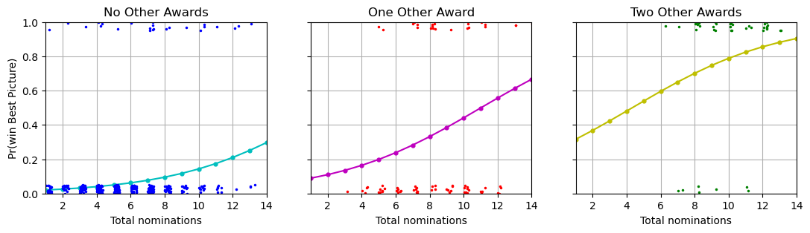

# Chapter 15: Other generalized linear models

[(Return to README)](./README.md)

This chapter kicks off with the term of art *link function.*  Just like the
inverse logit turned a weighted sum into $\text{Pr}(y = 1)$, link functions can
perform similar warps to predict "bounded or discrete data of different forms."

## Subsection rundown

### 15.1, Definition and notation

Four necessary ingredients, plus a set of optional ones, behind any generalized
linear model:

1.  Vector of outcome data, $y = (y_1, \ldots, y_n)$

2.  Matrix of predictors (one observation per row, one predictor per column) $X$
    and a vector of coefficients $\beta$, forming a linear predictor vector
    $X\beta$

3.  A link function $g$, yielding a vector of transformed data
    $\hat{y} = \text{E}(y | X, \beta) = g^{-1}(X\beta)$

4.  A data distribution, $\text{Pr}(y | \hat{y})$

5.  (Optional) other parameters like variances, overdispersions, and cutpoints,
    that apply to any of the above four ingredients

Some examples, beyond the linear and logistic regressions we've run so far:

*  **Poisson:** each outcome is a non-negative integer.  The link function is
    the logarithm, so $g^{-1}(z) = \exp(z)$.
*  **Negative binomial:** same outcomes and link function as Poisson regression, 
    but with an extra parameter to describe overdispersion, "variation in the 
    data beyond what would be predicted from the Poisson distribution alone."
*  **Logistic-binomial:** outcome $y_i$ is the number of successes observed
    out of $n_i$ attempts.  (They apologize for overloading $n_i$, number of
    tries for observation $i$, and $n$, the number of observations.)
    The link function is the logit, and the data distribution is the binomial.
*  **Beta-binomial:** Like logistic-binomial, but with an overdispersion
    parameter.
*  **Probit:** Like logistic regression, but replace the logit link function
    with the normal distribution's CDF.
*  **Multinomial logit/probit:** Extend the binary outcomes of logistic/probit
    models to categorical outcome.  These can be ordered or unordered
    categories.
*  **Robust:** the data distribution is given fatter tails than the usual
    normal distribution of the logistic regression.  The $t$ distribution is
    common here.

### 15.2, Poisson and negative binomial regression

#### Poisson model

The model:

$$y_i \sim \text{Poisson}\left(e^{X_i\beta}\right)$$

"The linear predictor $X_i\beta$ is the logarithm of the expected value of
measurement $y_i$." You should expect variation in the outcomes on the order of
$\sqrt{\text{E}(y)}$.

#### Overdispersion and underdispersion

If you look at your actual outcomes relative to the Poisson regression central
trend plus-or-minus that $\sqrt{\text{E}(y)}$ standard error, and see a bunch
of "outliers", you probably have overdispersion.  (Or, rarely, you see a 
too-tight clustering around the central trend, and you have underdispersion).

#### Negative binomial model for overdisperson

They don't go into the probability distribution or its sampling procedure, but,
they talk about how the negative binomial model brings in a reciprocal
dispersion parameter, $\phi > 0$, to set:

$$\text{sd}(y | x) = \sqrt{\text{E}(y | x) + \text{E}(y | x)^2/\phi}$$

As $\phi$ increases, we recover the original Poisson model.

#### Interpreting Poisson or negative binomial regression coefficients

The $X\beta$ linear predictor is being exponentiated, so $e^{\beta_j}$ gives you
the multiplicative effect on the expected change in $y_i$ when $x_i$ has a unit
increase in its $j$th predictor.

#### Exposure

Let's introduce the per-observation term $u_i$ to be the *exposure* of
observation $i$.  If we're observing count data, it can be useful to note the
absolute max value the count could have been: if you're modeling traffic
accidents at intersections as a function of intersection attribute, it can be
useful to use "number if cars that pass through the intersection" as that
intersection's exposure attribute.

$$y_i \sim \text{negative binomial}(u_i\theta_i, \phi),~~ \theta_i = e^{X_i\beta}$$

The equivalent term is *offset*, meaning, $\log(u_i)$.  The upshot is that
the $\beta$ coefficients now reflect change in outcomes per exposure unit per 
unit of predictor, rather than just outcomes per unit of predictor.

#### Including log(exposure) as a predictor in a Poisson or negative binomial regression

You can always just shove $\log(u_i)$ into one more column of $X$, and either
(a) force its coefficient to be 1, or (b) learn its coefficient value just like
any other predictor.  The float of (b) can make interpreting the other 
coefficients harder, but, it *could* allow for a better fit of model to data.

#### Differences between the binomial and Poisson or negative binomial models

If you have a natural limit on your outcomes, use a binomial model (which, when
$n_i = 1 \forall i$, is the logistic), and add overdispersion if needed.  
Otherwise, when the outcomes have no upper bound, use the log link function of
Poisson/negative binomial.  Though if the limit is much, much larger (like,
many orders of magnitude) than the expected outcome, you can use Poisson in that
case, too.

#### Example: zeroes in count data

A good way to check whether your estimated level of overdispersion matches the
data is to count zeros in the actual and predicted data.  Their example
(counting trapped roaches in apartments, where each apartment has an exposure
value of "number of days the traps were out") shows how Poisson regression does
bad on this front, but the negative binomial regression does okay.  (The NB
estimates many 1,000+ and even 1,000,000+ roach apartments, which never comes
close to being observed in the data.)

### 15.3, Logistic-binomial model

If you have many observations with identical predictors, all with binary
outcomes, you can bundle the identical-groups together as binomial outcomes
$y_i = k$ from $n_i$ trials.

The binomial distribution (like the Poisson) locks you into a strict
relationship between the mean and the variance.  They lay out a chi-squared test
you can use to see if the following standardized residuals:

$$\begin{align}
    z_i &= \frac{y_i - \hat{y}_i}{\text{sd}(\hat{y}_i)} \\
        &= \frac{y_i - \hat{y}_i}{\sqrt{n_i\hat{p}_i(1 - \hat{p}_i)}}
\end{align}$$

are distributed like a normal with zero mean and unit variance.

If they *aren't* distributed like a standard normal, then you have
overdispersion (or, very rarely, underdispersion).

They talk about how you can translate the binomial model's data matrix into
a binary logistic model instead, but, they then leave out what to do about
overdispersion in that case.  We had overdispersion in the count-data model,
and yet when we translate it to the equivalent binary-data model, the problem...
goes away?  They say, "Overdispersion at the level of the individual data points 
cannot occur in the binary model, which is why we did not introduce
overdispersed models in those earlier chapters."  But they don't talk about
what's eating the overdispersion sin by moving count data to binary data.

### 15.4, Probit regression: normally distributed latent data

Take the logistic regression model, and then swap the logistic distribution
for a normal distribution:

$$\text{Pr}(y_i = 1) = \Phi(X_i\beta)$$

or, in latent variable mode:

$$\begin{align}
    y_i &= \left\{\begin{align*}
        ~1 & ~\text{if}~z_i > 0 \\
        ~0 & ~\text{if}~z_i < 0,
    \end{align*}\right. \\
    z_i &= X_i\beta + \epsilon_i, \\
    \epsilon_i &\sim \mathcal{N}(0, 1),
\end{align}$$

where we freeze the variance of the $\epsilon$ RVs for identifiability.  (As
in Chapter 13, you can just scale that variance up and down alongside $\beta$
and get equivalent fits).

This has basically no effect on coefficient estimates w.r.t. using the logistic
instead, up to a 1.6x scaling factor.  There's... no reason to use it?

### 15.5, Ordered and unordered categorical regression

For $K$ ordered categorical outcomes, you can introduce coefficients
$c_j, j = 1, \ldots, K-1$ with the relationship:

$$\text{Pr}(y > j) = \text{logit}^{-1}(X\beta - c_j)$$

with $c_1 = 0$ frozen for the sake of identifiability.  These $c_j$ represent
cutpoints, defining boundaries between the $K$ ordinal-categorical zones claimed
over the linear predictor range.  The cutpoints are constrained to be strictly
increasing in $j$.

There are lots of ways to reparametrize this, especially in the univariate case.

And there are lots of ways to approach the problem other than the ordinal
logistic they fit as their example.  Use probit as the noise model instead of
logit.  Fit a linear regression, especially if $K$ is large and mostly high
entropy.  Fit a bunch of nested/sequential binary logistic regressions, one for
each this-category-or-higher cutoff.

The chapter ends by basically punting on what to do if you have *un*ordered
categorical outcomes.  They recommend fitting one model per category (which
definitely throws out information).

### 15.6, Robust regression using the $t$ model

The $t$ distribution's heavier tails means that coefficient estimates are less
sensitive to large-error observations, when used in a linear regression setting.

The logistric regression model can be swapped for the robit model, where the
noise applied to the linear predictor is a $t$ distribution with $\nu$ degrees
of freedom (and scaled so that it has unit variance;
$\epsilon_i \sim t_\nu(0, \sqrt{(\nu - 2)/\nu})$).  This allows for crazy Ivans,
where data can flip from 1 to 0 or vice versa no matter how far along the
central trend the predictors lie.

Robit regression leads to sharper sigmoids than the logistic model, since it
is happier to disregard the wacky outlier bitflips that the logistic model needs
to accommodate:

![From the book, Figure 15.7, whose caption reads "Hypothetical data to be
fitted using logistic regression: (a) a dataset with an “outlier” (the
unexpected y = 1 value near the upper left); (b) data simulated from a logistic
regression model, with no outliers. In each plot, the dotted and solid lines
show the fitted logit and robit regressions, respectively. In each case, the
robit line is steeper—especially for the contaminated data—because it
effectively downweights the influence of points that do not appear to fit the 
model](./fig/part3/fig15_07_robit.png)

Turns out robit and probit are linked: taking $\nu$ to infinity recovers the
probit model, and any value above $\nu = 7$ is basically indistinguishable from
probit.

### 15.7, Constructive choice models

They now repose the exact same regression operation (map input predictors to
output outcomes) as balancing incentives to reach a decision.  The version of
regression we've used so far is "a descriptive tool" for linking the outcome
and predictor variables.  They introduce here the choice model.

To build a choice model, you specify a value function, which defines a
particular preference value for each possible decision.  By convention, true
indifference to a decision option means the value function returns zero.
The value function considers both the decision option, plus the predictor terms
that describe the decider's situation at the time of the decision.

They look at the arsenic-well dataset again, and run a univariate regression to
predict "switched?" from "distance to nearest clean well (units: 100 m)".
The choice model gives every observed subject a triplet of random varaibles,
$(a_i, b_i, c_i)$ that determine:

*  $a_i$, the benefit of switching from an unsafe well to a safe one
*  $b_i + c_ix_i$, the cost of switching to a well $x_i$ distance away

They then say that $y_i = 1$, a switch for subject $i$, is dependent on those
random variables turning out the right way:

$$\text{Pr}(y_i = 1) = \text{Pr}(a_i > b_i + c_ix_i) = \text{Pr}\left(\frac{a_i - b_i}{c_i} > x_i\right)$$

If you define $d_i = (a_i - b_i)/c_i$, then you recover logistic regression if
the $d_i$ all follow a logistic distribution, and probit regression if they all
follow a normal distribution.  You never get to actually observe the RV triples
$(a_i, b_i, c_i)$ for subject $i$, only $(x_i, y_i)$.

This extends to multiple dimensions, and again, certain lucky breaks on how the
latent RVs are distributed means the model can recover familiar forms like
logistic or probit regression.

Fitting these requires more complicated software than the book is prepared to
introduce.  The RV triplets (or, $n$-tuples) for choice models are just
re-expressions of the error terms we've been using heretofor.  I like them,
I like the flexibility they offer.  The fact that the existing regressions we
have fit have interpretations under the choice model is a fun sensibility check.

### 15.8, Going beyond generalized linear models

#### Extending existing models

Easy extensions (using Stan or PyMC directly, which the book doesn't get into) 
include:

*  Heteroscedasticity.  Let the scale of the error term also depend on the
    predictors.
*  Baseline random binary outcomes.
    *  If there's a four-option multiple choice question, random guessing gets 
        you a 25% chance of success.  So go with
        $\text{Pr}(y = 1) = 0.25 + 0.75\text{logit}^{-1}(X\beta)$. I feel like
        there's some overlap here with having an intercept term, but, maybe this
        is like a useful prior constraint, like you're forcing the intercept to
        be 25%-success.
    *  If you have random data errors, where outcomes are just randomly toggled,
        you can go with
        $\text{Pr}(y = 1) = \epsilon_1 + (1 - (\epsilon_0 + \epsilon_1))\text{logit}^{-1}(X\beta)$.
        It lets your $\beta$ off the hook for trying to fit the random bit flip
        outcomes. 

#### Mixed discrete/continuous data

If you have an ostensibly continuous outcome, like income, but which also has
a single quite-common value, like "earned no income", you can fit two
regressions to be used sequentially at inference time:

1.  A classifier for "is this datapoint from the spike, or not"
2.  A regressor for "what is the outcome for this non-spike datapoint"

#### Latent-data models

Another way to handle the above is that everyone has a latent variance of their
earnings, but we only observe earnings when $y > 0$.  They namecheck Tobit
regression for this.

#### Cockroaches and the zero-inflated negative binomial model

In the binomial and Poisson models, where the coefficients describe a latent
rate at which an event occurs, that continuous rate can also have spiky discrete
aspects.  This is very similar to the previous two cases, but in their example,
some apartments just are permanently cockroach-free, and always have $y_i = 0$
no matter the predictor values, whereas others operate under the 
cockroach-susceptible negative binomial model.  You can have a whole nother
binary classifier for deciding which of the two apply to subject $i$.

#### Prediction and Bayesian inference

If you do fit the above models, you have to use both the discrete and the
continuous to produce inferences, including to plot results.


## Exercises

Plots and computation powered by [Chapter15.ipynb](./notebooks/Chapter15.ipynb)

### 15.1, Poisson and negative binomial regression

> The
> [folder `RiskyBehavior`](https://github.com/avehtari/ROS-Examples/tree/master/RiskyBehavior/)
> contains data from a randomized trial targeting couples at high risk of HIV
> infection. The intervention provided counseling sessions regarding practices
> that could reduce their likelihood of contracting HIV. Couples were randomized
> either to a control group, a group in which just the woman participated, or a
> group in which both members of the couple participated. One of the outcomes
> examined after three months was "number of unprotected sex acts."
> 
> (a) Model this outcome as a function of treatment assignment using a Poisson 
>     regression. Does the model fit well? Is there evidence of overdispersion?
> 
> (b) Next extend the model to include pre-treatment measures of the outcome and
>     the additional pre-treatment variables included in the dataset. Does the
>     model fit well? Is there evidence of overdispersion?
> 
> (c) Fit a negative binomial (overdispersed Poisson) model. What do you
>     conclude regarding effectiveness of the intervention?
> 
> (d) These data include responses from both men and women from the
>     participating couples. Does this give you any concern with regard to our
>     modeling assumptions?

The numerical columns from `risky.csv`:

|         | couples | women_alone | bupacts | fupacts
--------- | ------- | ----------- | ------- | -------
**count** | 434.00 | 434.00 | 434.00 | 434.00
**mean**  | 0.37 | 0.34 | 25.91 | 16.49
**std**   | 0.48 | 0.47 | 31.92 | 26.83
**min**   | 0.00 | 0.00 | 0.00 | 0.00
**25%**   | 0.00 | 0.00 | 5.00 | 0.00
**50%**   | 0.00 | 0.00 | 15.00 | 5.00
**75%**   | 1.00 | 1.00 | 36.00 | 20.93
**max**   | 1.00 | 1.00 | 300.00 | 200.00

From looking at
[the actual publication](https://pmc.ncbi.nlm.nih.gov/articles/PMC1447878/), it
seems like `fupacts` is "follow-up unprotected acts" (vs. `bupacts`, "baseline
unprotected acts").

When I fit the model prescribed in (a), `fupacts ~ couples + women_alone`,
I get narrow uncertainty ranges for all coefficients:

Coef.       | Mean  | s.e.
----------- | ----- | ------
Intercept   |  3.09 | 0.02
couples     | -0.32 | 0.03
women_alone | -0.58 | 0.03

Makes sense that the widths are low, this is just fitting the mean to each
treatment group, modulo that shared intercept.

Here is a plot of (a) density of actually-observed outcomes and (b) posterior
predicted outcomes. This sure looks like the overdispersion examples seen in the
book.


Per part (b), the model is extended with the additional predictors (including
the categorical `sex` and `bs_hiv`) as
`fupacts ~ couples + women_alone + sex + bs_hiv + bupacts`:

Coef.            | Mean  | s.e.
---------------- | ----- | ------
Intercept        |  2.78 | 0.03
couples          | -0.41 | 0.03
women_alone      | -0.67 | 0.03
sex[woman]       |  0.11 | 0.02
bs_hiv[positive] | -0.44 | 0.04
bupacts          |  0.01 | 0.00

Still quite narrow uncertainty ranges, that's neat!

But still overdispersed, so, not a great fit:


When I change the link function to negative binomial, I get the coefficients:

Coef.            | Mean  | s.e.
---------------- | ----- | ------
Intercept        |  2.46 | 0.18
couples          | -0.35 | 0.19
women_alone      | -0.73 | 0.19
sex[woman]       | -0.02 | 0.15
bs_hiv[positive] | -0.55 | 0.20
bupacts          |  0.02 | 0.00

And when I check the dispersion -- yes, that's what we like to see:


I check the models' performances with the LOO utility:

[ELPD_LOO model comparison; part (a)'s is worst, between -8000 and -6500,
part (b)'s is a real improvement, between -6200 and -5200, and the negative
binomial of part (c) is miles better with no uncertainty width at
-1400](./fig/part3/ex15_01_compare.png)

Yeah, all checks out.

### 15.2, Offset in a Poisson or negative binomial regression

> Explain why putting the logarithm of the exposure into a Poisson or negative
> binomial model as an offset, is equivalent to including it as a regression
> predictor, but with its coefficient fixed to the value 1.

The Poisson's likelihood assumes that:

$$y_i \sim \mathbb{E}[\exp(x_i^T\beta)]$$

The exposure is a multiplier associated with each observation that's supposed to
scale the expected outcome up and down.  If we're counting lattes sold among
stores with/without in-store ads pushing them, it's reasonable to scale that by
"how many customers came in while we were counting."

$$y_i \sim \mathbb{E}[u_i\exp(x_i^T\beta)]$$

We can just pull that number-of-customers exposure value $u_i$ up into the
exponent:

$$\begin{align}
    y_i &\sim \mathbb{E}[\exp(\log u_i)\exp(x_i^T\beta)] \\
     &\sim \mathbb{E}[\exp(\log u_i + x_i^T\beta)]
\end{align}$$

That is equivalent to the original equation but with (a) concatenating a
$\log u_i$ term into the predictor vector $x_i$, and (b) concatenating a 1
into the $\beta$ coefficient vector:

$$x_i \in \mathbb{R}^p \rightarrow
    x_i := [\log u_i, x_{i1}, \ldots, x_{ip}] \in \mathbb{R}^{p+1}$$
$$\beta \in \mathbb{R}^p \rightarrow
    \beta := [1, \beta_1, \ldots, \beta_p] \in \mathbb{R}^{p+1}$$

So, a new coefficient, frozen at 1 forever.  This freezing has the same value
proposition as any prior info: you *could* make the model learn a coefficient to
multiply $\log u$ to maximize predictive power, but if that estimate winds up
with high uncertainty (due to low data volume relative to your sample size and
predictor covariance structure) you might accidentally get told an inappropriate
value.  Maybe take the sure thing, freeze it at 1, and call that good enough.

### 15.3, Binomial regression

> Redo the basketball shooting example on page 270, making some changes:
> 
> (a) Instead of having each player shoot 20 times, let the number of shots per
>     player vary, drawn from the uniform distribution between 10 and 30.
> 
> (b) Instead of having the true probability of success be linear, have the true
>     probability be a logistic function, set so that $\text{Pr(success)} = 0.3$
>     for a player who is 5'9" and 0.4 for a 6' tall player.

Working out the logistic regression parameters:

$$\text{logit}(0.3) = a + 69b$$
$$\text{logit}(0.4) = a + 72b$$
$$b = (\text{logit}(0.4) - \text{logit}(0.3)) / 3 = 0.15$$
$$a = \text{logit}(0.4) - 72(0.15) = -11.01$$

When I fit a logistic binomial to `p(hits, shots) ~ height`, the correct
parameters are recovered:

Coef.     | Mean   | s.e.
--------- | ------ | ------
Intercept | -13.54 | 1.29
height    |   0.18 | 0.02

### 15.4, Multinomial logit

> Using the individual-level survey data from the 2000 National Election Study
> (data
> [in folder `NES`](https://github.com/avehtari/ROS-Examples/tree/master/NES/)),
> predict party identification (which is on a five-point scale) using ideology
> and demographics with an ordered multinomial logit model.
> 
> (a) Summarize the parameter estimates numerically and also graphically.
> 
> (b) Explain the results from the fitted model.
> 
> (c) Use a binned residual plot to assess the fit of the model.

Here is a summary of the demographic data, plus party ID, pulled out of
`nes.txt`:

|         | year | income | age | gender | race | real_ideo | martial_status | partyid7
--------- | ---- | ------ | --- | ------ | ---- | --------- | -------------- | --------
**count** | 474.00 | 474.00 | 474.00 | 474.00 | 474.00 | 474.00 | 474.00 | 474.00
**mean**  | 2000.00 | 3.03 | 47.61 | 1.53 | 1.53 | 4.31 | 2.01 | 3.82
**std**   | 0.00 | 1.11 | 15.84 | 0.50 | 1.18 | 1.41 | 1.44 | 2.16
**min**   | 2000.00 | 1.00 | 18.00 | 1.00 | 1.00 | 1.00 | 1.00 | 1.00
**25%**   | 2000.00 | 2.00 | 36.00 | 1.00 | 1.00 | 3.00 | 1.00 | 2.00
**50%**   | 2000.00 | 3.00 | 45.00 | 2.00 | 1.00 | 4.00 | 1.00 | 4.00
**75%**   | 2000.00 | 4.00 | 57.75 | 2.00 | 1.00 | 5.00 | 3.00 | 6.00
**max**   | 2000.00 | 5.00 | 91.00 | 2.00 | 5.00 | 7.00 | 7.00 | 7.00

The coefficient estimates:

Coef.        | Mean   | s.e.
------------ | ------ | ------
threshold[0] | -0.39 | 0.33
threshold[1] |  0.42 | 0.33
threshold[2] |  1.17 | 0.33
threshold[3] |  1.51 | 0.33
threshold[4] |  2.27 | 0.34
threshold[5] |  3.31 | 0.35
income       |  0.09 | 0.07
age          | -0.02 | 0.01
gender       | -0.58 | 0.15
real_ideo    |  0.65 | 0.06


I could not quite figure out how to get class predictions out of this model, in
a way that I trust.  And the book has no examples of residual plots for
ordinal regression.  So I hacked this together: boxplot distributions of linear
predictor values by the observations actual party ID class, along with the
thresholds fit by the model:


### 15.5, Comparing logit and probit

> Take one of the data examples from Chapter 13 or 14. Fit these data using both
> logit and probit models. Check that the results are essentially the same after
> scaling by factor of 1.6 (see Figure 15.4).

I choose the arsenic-wells dataset from Exercise 14.7, using the interaction
model specified with:

`switch['1'] ~ dist100 + log_arsenic + dist100:log_arsenic`.

The logit model coefficient estimates:

Coef.               | Mean  | s.e.
------------------- | ----- | ------
Intercept           |  0.49 | 0.07
dist100             | -0.88 | 0.13
log_arsenic         |  0.98 | 0.11
dist100:log_arsenic | -0.23 | 0.18

And the probit model coefficient estimates:

Coef.               | Mean  | s.e.
------------------- | ----- | ------
Intercept           |  0.30 | 0.04
dist100             | -0.54 | 0.08
log_arsenic         |  0.59 | 0.07
dist100:log_arsenic | -0.12 | 0.11

The four ratios here are {1.63, 1.63, 1.66, 1.92}, which, yep, essentially the
same up to that scale factor of -1.6.  The interaction terms is a little off,
though those are also the higher-uncertainty coefficient estimates.

Also essentially the same in terms of ELPD LOO performance:


### 15.6, Comparing logit and probit

> Construct a dataset where the logit and probit models give clearly different
> estimates, not just differing by a factor of 1.6.

TK

### 15.8, Robust linear regression using the $t$ model

> The
> [folder `Congress` has](https://github.com/avehtari/ROS-Examples/tree/master/Congress/)
> the votes for the Democratic and Republican candidates in each U.S.
> congressional district in 1988, along with the parties' vote proportions in
> 1986 and an indicator for whether the incumbent was running for reelection
> in 1988. For your analysis, just use the elections that were contested by both
> parties in both years.
> 
> (a) Fit a linear regression using `stan_glm` with the usual
>     normal-distribution model for the errors predicting 1988 Democratic vote
>     share from the other variables and assess model fit.
> 
> (b) Fit the same sort of model using the brms package with a $t$ distribution,
>     using the `brm` function with the `student` family. Again assess model
>     fit.
> 
> (c) Which model do you prefer?

For the model formula `v88 ~ v86 + inc86 + inc88`, the normal model coefficients
are:

Coef.     | Mean   | s.e.
--------- | ------ | ------
sigma     | 0.07 | 0.00
Intercept | 0.17 | 0.02
v86       | 0.66 | 0.04
inc86     | -0.03 | 0.01
inc88     | 0.10 | 0.01

and the $t$ model coefficients are identical:

Coef.     | Mean   | s.e.
--------- | ------ | ------
sigma     | 0.06 | 0.00
Intercept | 0.16 | 0.02
v86       | 0.66 | 0.04
inc86     | -0.03 | 0.01
inc88     | 0.10 | 0.01

So suspiciously close that I checked the priors on the noise in the $t$ model:

```
        Auxiliary parameters
            nu ~ Gamma(alpha: 2.0, beta: 0.1)
            sigma ~ HalfStudentT(nu: 4.0, sigma: 0.1928)
```

Yup, as advertised.

The model LOO performance comparison bears this out:


So, I suppose for simplicity's sake, I prefer the normal error model.

### 15.9, Robust regression for binary data using the robit model

> Use the same data as the previous example with the goal instead of predicting
> for each district whether it was won by the Democratic or Republican
> candidate.
> 
> (a) Fit a standard logistic or probit regression and assess model fit.
> 
> (b) Fit a robit regression and assess model fit.
> 
> (c) Which model do you prefer?

(Have to pass on this: it's not a
[link function that comes standard](https://github.com/bambinos/bambi/blob/5110615e2aff5e4689af1b8325fdf447a8531b0a/bambi/families/link.py#L96)
in Bambi, and I don't know how to implement a $t$ distribution's CDF as a
PyTensor backend.)

### 15.12, Spatial voting models

> Suppose that competing political candidates A and B have positions that can be
> located spatially in a one-dimensional space (that is, on a line). Suppose
> that voters have "ideal points" with regard to these positions that are
> normally distributed in this space, defined so that voters will prefer
> candidates whose positions are closest to their ideal points. Further suppose
> that voters' ideal points can be modeled as a linear regression given inputs
> such as party identification, ideology, and demographics.
> 
> (a) Write this model in terms of utilities.
> 
> (b) Express the probability that a voter supports candidate S as a probit
>     regression on the voter-level inputs.
> 
> See Erikson and Romero (1990) and Clinton, Jackman, and Rivers (2004) for
> background.

TK

### 15.13, Multinomial choice models

> Pardoe and Simonton (2008) fit a discrete choice model to predict winners of
> the Academy Awards. Their data are in
> [the folder `AcademyAwards`](https://github.com/avehtari/ROS-Examples/tree/master/AcademyAwards).
> 
> (a) Fit your own model to these data.
> 
> (b) Display the fitted model on a plot that also shows the data.
> 
> (c) Make a plot displaying the uncertainty in inferences from the fitted
>     model.

I trimmed down the large CSV to just the rows of Best Picture nominees, and
built three columns: did the movie *win* Best Picture, how many total Oscar
nominations did it have, and how many other best picture awards (Golden Globes
or PGA) did it win.  The resulting dataframe:

|         | best_picture | total_noms | other_wins
--------- | ------------ | ---------- | ----------
**count** |       453.00 |     453.00 | 453.00
**mean**  |         0.17 |       6.43 |   0.34
**std**   |         0.38 |       2.89 |   0.63
**min**   |         0.00 |       1.00 |   0.00
**25%**   |         0.00 |       4.00 |   0.00
**50%**   |         0.00 |       6.00 |   0.00
**75%**   |         0.00 |       8.00 |   1.00
**max**   |         1.00 |      14.00 |   2.00

When I fit the logistic regression model
`best_picture['1'] ~ total_noms + other_wins` I get the coefficent estimates:

Coef.      | Mean  | s.e.
---------- | ----- | ------
Intercept  | -4.11 | 0.46
total_noms |  0.23 | 0.06
other_wins |  1.55 | 0.22

Here are three plots showing the data and model when the movie got zero, one, or
two other major best picture awards:



I can convey some of the model uncertainty by tracing logistic curves governed
by individual coefficient draws from the MCMC routine:


### 15.14, Model checking for count data

> The folder `RiskyBehavior` contains data from a study of behavior of couples
> at risk for HIV; see Exercise 15.1.
> 
> (a) Fit a Poisson regression predicting number of unprotected sex acts from
>     baseline HIV status. Perform predictive simulation to generate 1000
>     datasets and record the percentage of observations that are equal to 0 and
>     the percentage that are greater than 10 (the third quartile in the
>     observed data) for each. Compare these to the observed value in the
>     original data.
> 
> (b) Repeat (a) using a negative binomial (overdispersed Poisson) regression.
> 
> (c) Repeat (b), also including ethnicity and baseline number of unprotected
>     sex acts as inputs.

In the original data, 29% of the outcomes have count zero, and 36% of the
outcomes have a count above 10.

The Poisson model is terrible on this score, there's literally never any
zero-count predictions:


Switching to a negative binomial helps a lot:


Unfortunately, adding those predictors (there was no ethnicity, so I used sex
instead) doesn't help at all:


### 15.16, Average predictive comparisons

> (a) Take the roach model of well switching from Section 15.2 and estimate the
>     average predictive comparisons for logarithm of roach count, for each of
>     the input variables in the model.
> 
> (b) Do the same thing but estimating average predictive comparisons for roach
>     count itself.

When I fit the negative binomial regression of
`y ~ roach100 + treatment + senior + offset(log(exposure2))`, I get the
coefficient estimates of:

Coef.     | Mean  | s.e.
--------- | ----- | ------
alpha     |  0.27 | 0.03
Intercept |  2.85 | 0.24
roach100  |  1.32 | 0.25
treatment | -0.78 | 0.25
senior    | -0.33 | 0.27

Where `alpha` controls the variance: for mean $\mu$, the variance is
$\frac{\mu^2}{\alpha} + \mu$.

The average predictive comparisons for log of roach count is just equal to those
values above.  The exposure terms all cancel out, and the log-count just moves
by that coefficient amount on average, for a unit increase in the predictor
value.

In terms of actual roach count, the average predictive comparison comes to:

*  `roach100`: 171.3 more roaches expected for every 100 roaches seen pre-study
*  `treatment`: -34.0 roaches if you apply the treatment
*  `senior`: -17.7 if it's an apartment complex for seniors

### 15.17, Learning from social science data

> The General Social Survey (GSS) has been conducted in the United States every
> two years since 1972.
> 
> (a) Go to the GSS website and download the data. Consider a question of
>     interest that was asked in many rounds of the survey and which is a count
>     variable. Decide how you will handle nonresponse in your analysis.
> 
> (b) Make a graph of the average response of this count variable over time,
>    each year giving $\pm1$ standard error bounds, as in Figure 4.3, computing
>    the standard error for each year as $\text{sd}(y)/\sqrt{n}$ using the data
>    from that year.
> 
> (c) Set up a negative binomial regression for this outcome given predictors
>     for age, sex, education, and ethnicity. Fit the model separately for each
>     year that the question was asked, and make a grid of plots with the time
>     series of coefficient estimates $\pm$ standard errors over time.
> 
> (d) Discuss the results and how you might want to expand your model to answer
>     some social science question of interest.

TK