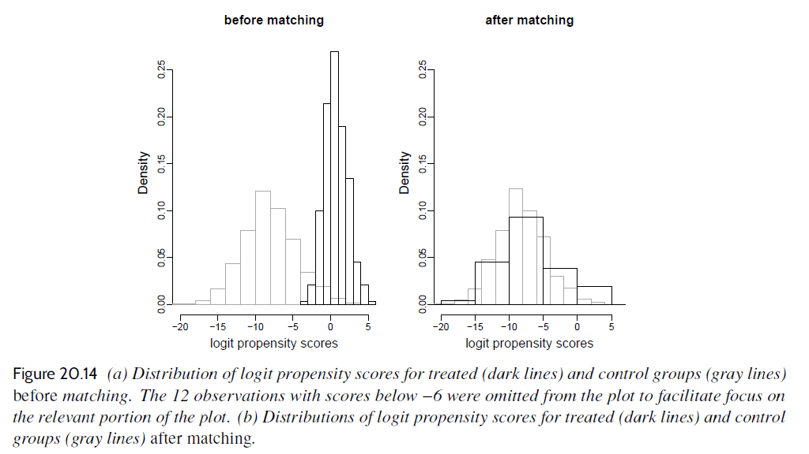

# Chapter 20: Observational studies with all confounders assumed to be measured

[(Return to README)](./README.md)

Chapter 18 already went over how randomization can be less than complete.  This
chapter takes that one step further: randomization can be so watered down that
it basically vanishes.  It "discusses methods for causal inference in the
presence of systematic pre-treatment differences between treatment and control
groups. A key difficulty is that there can be many pre-treatment variables with
mismatch, hence the need for adjustment on many variables."  The implication
here is that *if*, per the chapter title, all counfounders are assumed to be
measured, we can draw *some* kind of causal inference from a treatment (even if
that treatment is selected into/away from by subjects).

## Subsection rundown

### 20.1, The challenge of causal inference

The chapter opens with two examples of observational studies where the
regression coefficients *don't* lend themselves to causal inference.

1.  **Hypothetical example of zero causal effect but positive predictive
    comparison:**  if the treatment does nothing, but healthy patients sort into
    the treatment group (and sicker ones the control group), you get a positive
    coefficient if you fit a univariate model predicting patient health outcomes
    from patient treatment group assignment.

2.  **Hypothetical example of positive causal effect but zero positive
    predictive comparison:** if instead *sicker* patients sort preferentialy
    into the treatment group, then even a genuinely-helpful treatment can wind
    up looking inert (or bad).  "It is then possible to see equal average
    outcomes of patients in the two groups, with sick patients who received the
    treatment canceling out healthy patients who received the control."

The systematic nature of the sorting in these scenarios is important.  It's not
just bad luck that your two treatment groups are unbalanced w.r.t. patient
pre-treatment health status.  The sicker patients are systematically driven to
one group or the other, and resampling or increasing sample size won't fix the
imbalance that's inducing the coefficient-vs.-actual-effect mismatch.

The chapter introduces the term *confounding covariate* to describe the
pre-treatment predictor that drives the selection bias.  Omitting these
confounders from the model, leaving them as lurking variables, wrecks the
causal effect estimate (i.e., treatment indicator coefficient estimate).

The section closes out with algebra around omitted variable bias, where there's
a mechanism linking outcome $y$ to confounder $x$ and treatment indicator $z$,
as well as linking $x$ to $z$.  Both links are linear and additive, so the
book doesn't really dwell on the implications of the algebra: we know that's not
a realistic description of how the real-world values of $x$, $y$, and $z$
interrelate, so trying to draw out strong intuition for what "omitted variable
bias" looks like from this peculiar case is not really a good use of time.

### 20.2, Using regression to estimate a causal effect from observational data

In observational studies, the research design is nonexperimental, and you don't
directly manipulate any of the covariates used to predict the outcome.  "\[I\]f
we observe differences in average outcomes across these groups, we can't
separately attribute these differences to the treatment or the confounders --
the effect of the treatment is thus 'confounded' by these variables."

If you couldn't/didn't observe *all* the relevant confounders, none of the
techniques in this chapter will be fairly useless.

The motivating example in the section is to expand the Electric Company
education study from Chapter 19, now with more detail included.  Classrooms were
randomly given (or not-given) the Electric Company educational program to show
in-class.  But teachers who received the material could use it to either replace
or supplement their normal lesson plans.  That decision is nonrandom, and so
turns the study of "control vs. replace vs. supplement" into an observational
one.

The study includes pre-treatment test scores as a covariate.  If that were the
*only* basis on which teachers decided between "replace" and "supplement,"
then the decision satisfies "a form of the ignorability assumption discussed in
[Section 18.6](chapter18.md#186-properties-assumptions-and-limitations-of-randomized-experiments).
That's likely untrue, but, "the ignorability assumption can be a useful
starting point, especially in a setting such as this where pre-test score is
such a strong predictor of post-test score."

If we agree the ignorability assumption is satisfied (or just close enough to
being satisfied), there's still all the other assumptions from
[Section 11.1](chapter11.md#111-assumptions-of-regression-analysis) to worry 
about.  Later, this chapter introduces balance and overlap, a.k.a. *common
support*, that needs addressing before you can declare a regression coefficient
estimate a useful causal effect estimate.

### 20.3, Assumption of ignorable treatment assignment in an observational study

They compare the studies in this chapter with the block-randomized studies
in Chapter 18.  The difference is that in Ch. 18, the blocking attribute was,
"by design," the only covariate relevant to treatment assignment.  So it was
easy to be sure your model had all confounders included: there's only the one,
and it's what you used to block subjects into groups.  Now, we don't know for
sure whether we have the complete set of "blocking" confounders that drive
treatment assignment.

Actually incorporating confounders -- when there's lots of them; when they're
continuous -- lets you make use of the ignorability assumption, 

$$y^0, y^1 \perp z, x$$

but you have to build a parameteric model linking the three variables in all but
the simplest cases of $x$ and $z$.  (The chapter walks through a nonparametric
model for the simple case where $x$ is a single confounder that's a binary
indicator.)

### 20.4, Imbalance and lack of complete overlap

Ignorability is unsatisfied if treatment and control are not comparable.  If
that lack of comparability happens along an unobserved data axis, then nothing
in this chapter works.  But to repeat for like a fourth time: let's assume that
you *do* observe all attributes that serve as confounders to the treatment
indicator.  If you make that assumption, you can warp your observed data to make
treatment and control comparable again, and causal inference is revived.

Equation 20.3 describes what happens when you take sample averages of the
treatment and control group when the outcome also depends, quadratically, on a
confounder:

$$\theta = \bar{y}_1 - \bar{y}_0 - \beta_1\left(\bar{x}_1 - \bar{x}_0\right) - \beta_2\left(\bar{x^2_1} - \bar{x^2_0}\right)$$

To estimate $\theta$ correctly from a regression of $y$ on $(x, z)$, you need to
know to include both $x$ and $x^2$ as covariates in the model.  This is what
they mean by "\[i\]mbalance and lack of complete overlap are issues for causal
inference even if ignorability holds because they force us to rely more heavily
on model specification and less on direct support from the data."

They use the term *overlap* (a.k.a. *common support*) to talk about how
confounder value distributions compare across the treatment-control divide.
Visually:

When there's lack of complete overlap, "the data are inherently limited in what
they can tell us about treatment effects in the regions of nonoverlap."  Who
knows if there's just a magic interaction happening exactly in that spot of
covariate space where we see $x$'s for the treatment units but not the control.
Talking about those kinds of units means talking about your model (and modeling
assumptions) and not about anything gleaned from the study data itself.

Put another way, your model will let you extrapolate beyond the support of the
data (either for treatment units, control units, or both).  But by definition,
you can't check the fit outside the data support.  You're just hoping your model
is good enough, instead of doing any quality control.

### 20.5, Example: evaluating a child care program

The example compares a treated group of 290 premature, low-birth-weight babies
against a control group of 4,091 other babies.  A good dozen confounding
covariates are noted, and Fig 20.9 displays how greatly they vary between
groups:

It makes sense that birth weight is the largest difference; it's literally the
treatment selection criteria.

They discuss how all the confounders have imbalance, but only some have lack of
complete overlap.  Birth weight, in particular, is capped in the treatment group
at 2500 grams, and so any treatment interaction trend beyond that is just
extrapolating from the fit model.

In general, they come just short of recommending dropping units from the control
group who fall outside treatment group support on 

(The outcome for this example is a cognitive ability test score, which is pretty
much an afterthought.  This chapter is all about the predictors, not the
outcomes.)

### 20.6, Subclassification and average treatment effects

The chapter has stressed a few times how weird it feels to rely on extrapolation
from a fit model when faced with imbalance between treatment and control.  So
this section asks, what can be done nonparametrically.  They break the above
example out into mother's-education indicator blocks and look at between group
differences in average outcomes within each block.  They concede this is bad; it
makes the ignorability assumption even though it's clear important covariates
are omitted from consideration.  Also, they could only conduct this because they
had discrete buckets of units to compare, and bucketizing a continuous covariate
in a similar way throws out information.

Once they have estimates for the effect in each bucket, they derive an average
treatment effect (a weighted average, where the weights are total baby count
across both treatment groups).

Circling back to "should we throw out control group data to address incomplete
overlap with the training group," they introduce the term *average effect of the
treatment on the treated (ATT)*.  Only certain babies are eligible for the
treatment, so the comparison should be between treated babies and control group
babies that meet the criteria.

They repeat the earlier subcategory bucketing, and find ATT by taking the same
weighted average, but with weights that are only baby counts from the treatment
buckets.  (ATC does the same thing, but with baby counts in the control
buckets.)

They close with:

> We can think of the estimate of the effect of the treatment on the treated as
> a poststratified version of the estimate of the average causal effect. As the
> methods we discuss in this section rely on more and more covariates, it can be
> more attractive to apply methods that estimate the effect of the treatment on
> the treated while avoiding explicit stratification on all potential treatment
> effect modifiers, as we discuss next.

If you make your buckets the crossproduct of a bunch of different attributes,
your unit counts will wind up too low to say anything useful.

### 20.7, Propensity score matching for the child care example

Matching: if there's systematic difference between treatment and control, then
try and restore balance by matching each treatment unit with a most-similar
control unit.  *Propensity score matching* is the version they walk through
here.  It's a five step process.

#### Step 1: Defining the confounders and estimand

1.  What covariates are required to satisfy ignorability?  Maybe you have to
    rely on conventional choices of what to include, based on prior work in your 
    field.  Or maybe there's few enough on record that you can just use them
    all.

2.  Are you estimating ATT?  ATC?  Average treatment effect on some third
    population beyond treatment and control?  Call whatever group you're going
    to try and balance towards the *inferential group.*

At this point, I am a little wrongfooted by the introduction of ATT and ATC.
It seems like they're just saying "an interaction between $z$ and $x$" without
actually acknowledging that that's what they're recommending.

#### Step 2: Estimating the propensity score

Fit a binary classifier that turns the covariates above into a probability of
being in the treatment group:

$$\text{Pr}(z = 1) = \text{logit}^{-1}(\beta \cdot x)$$

They promise checking the success of this model fit effort will come later.

The predictions you get out of this classifier are the propensity scores, i.e.,
the propensity for a unit to have wound up in the inferential group, as a
function of the confounder covariates.

#### Step 3: Matching to restructure data

Once you have the model, score every unit in treat and control.  Then (when your
estimand in Step 1 is ATT, and so you inferential group is "treatment") just
pair every treat unit with the control unit that has the closest propensity
score.

This matching can be done with or without replacement.  Matching *with*
replacement is recommended, while noting that it increases variance of
estimates.  (You might oversample the same control unit a lot, and your estimate
now is overly reliant on the weird aspects of that one oversampled control
unit.)

#### Step 4: Diagnostics for balance and overlap

Like in Fig 20.9, once you have your matched dataset, you can look at
differences in mean values between treat and control for each confounder
(standardized for continuous confounders, left as means for binary confounders).

You can also plot histograms of the propensity scores for treat and control,
pre- and post-matching routine:

You can use the support range of propensity scores to throw away more data:
only include treat units that fall in the propensity range of the control units.

You should loop here: if the balance diagnostics are bad, go back and upgrade
the classifier of Step 2.

#### Step 5: Estimating a treatment effect using the restructured data

Run a regression.

The coefficient for the treatment variable is going to be off somewhat: "the
propensity score has been estimated from the data is not reflected in our
calculations. This issue has no perfect solution to date and is currently under
investigation by researchers in this field."  The standard errors are going to
be too narrow because you're working off the same data twice.

### 20.8, Restructuring to create balanced treatment and control groups

Some things to consider in general, beyond the specifics of matching to restore
balance between treatment and control:

#### Step 1: Estimands and confounders

*  **Defining the population of interest:** Make sure your estimand target
    matches the research goals.  Unless you genuinely don't have a way to match
    treat units with comparable control units -- then maybe fall back to a less
    specific estimand than ATT.

*  **Choosing covariates:** Maybe you have too few covariates to assume
    ignorability; that's bad and you should flag it.  Or you have too *many*
    covariates.  We saw how to include them all and regularize the model fit,
    but you can also just pre-prune the covariate list for simplicity.
    Definitely drop any post-treatment predictors.  You should also hold off on
    covariates that strongly correlate to $z$ but not $y$ (and seek out the
    ones that *do* strongly predict $y$).

#### Step 2: Calculating distance metrics: finding observations with different treatments that are similar in their pre-treatment characteristics

The propensity score is *a* distance metric, but you can try other ones, too.
Mahalanobis distance is encouraged, though it "defines proximity based on what
are arguably specialized neighborhoods of the covariate space."

They talk about some ironies of the propensity score classifier.  If it does a
perfect job -- gives every treat unit a score of 1 and every control a score of
0 -- it's totally useless as a matching function.  And in situations where
randomization has worked perfectly, then you can't fit a classifier at all.
Plus you get dumb matches from the linearity and additivity: two matched units
can be very different in their covariates while still having identical
propensity scores, because the wild swings cancel out overall.

This all reinforces my longstanding sense that unsupervised learning ("what
counts as two units being close across this $N$ dimensional manifold") is hard
to evaluate and no one knows how to do it.

#### Step 3: Restructuring the data

*  **Matching algorithms:** So many choices, beyond just with-or-without
    replacement.  You can do many-to-one matching, where some treat units get
    many control units matched to it, based on some distance threshold.  You
    can do a Gale-Shapley style optimal matching.  You can do greedy algorithms
    in various different orderings of which treat gets matched first.

*  **Matching as weighting scheme:** The restructuring used above is like 0-1
    weighting: control units are either selected as a treat match, or aren't.
    But you can pick different weight assignment schemes.  (They tend to
    correspond to some matching algorithm or other; the book goes into how
    caliper matching would work for controls that fall within the distance
    thresholds of multiple treats.)

*  **Inverse probability weighting:** Instead of using the propensity score for
    hard matching, warp them into per-unit weights.  Different warps apply to
    different estimands.
    *  **ATE**: Treats get a weight of $1/\hat{p}$; controls get a weight of
        $1/(1 - \hat{p})$.
    *  **ATT**: Treats get a weight of 1; controls get a weight of
        $\hat{p} / (1 - \hat{p})$.
    *  **ATC**: Treats get a weight of $(1 - \hat{p}) / \hat{p}$; controls get a
        weight of 1.

When weighting, be careful you don't assign degenerately large weights to some
few units that wind up defining the whole model fit.

#### Step 4: Diagnostics: Balance and overlap

It's not useful to look at histograms of propensity scores for treat and control
and see if they are similar.  A model that's pure randomness can generate good
histogram similarity and be useless for propensity score matching.

Use standard techniques (e.g., LOO-CV) to test the propensity score model's fit.

Go back and fix the propensity score model as needed, but don't tweak it just so
that your treatment effect estimate is made stronger/more publishable.

#### Step 5: Estimating the treatment effect using restructured data

Right, run the regression now.  Don't worry about the pairing off; the point is
not to have matched pairs that are meaningfully linked, but to have two groups
that in aggregate are comparable.

### 20.9, Additional considerations with observational studies

TK

## Exercises

Plots and computation powered by [ChapterK.ipynb](./notebooks/ChapterK.ipynb)

### K.x, Exercise italic title

> The problem statement

The answer